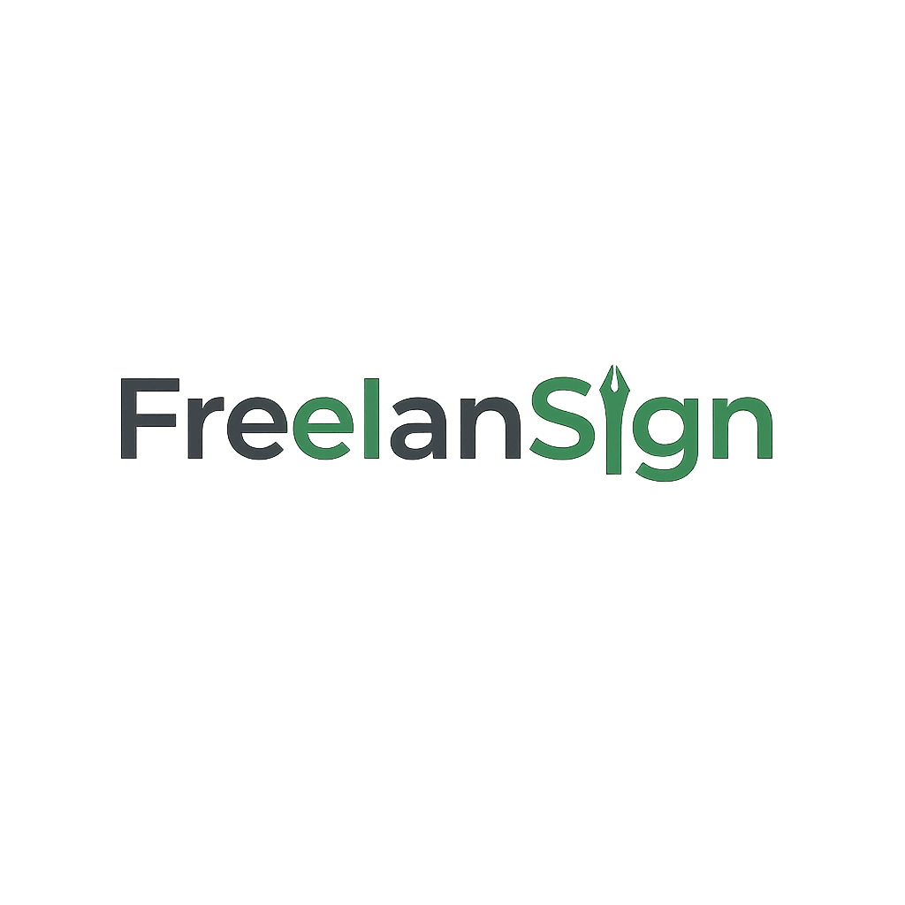

# FreelanSign

**FreelanSign c'est quoi ?**

C'est une plateforme professionnelle de **gestion des devis et des factures** pour les freelances et les entrepreneurs indépendants français.

## À propos

**FreelanSign** est une solution SaaS qui simplifie le flux de travail administratif des professionnels indépendants. Elle permet aux freelances de créer, personnaliser et gérer des devis professionnels grâce à des fonctionnalités intégrées de conformité juridique spécifiques à la réglementation française.

La plateforme répond au caractère chronophage des tâches administratives en fournissant une interface intuitive pour la génération de devis, la personnalisation de l'image de marque professionnelle et la gestion des clients.

## Pourquoi FreelanSign?

1. **Gagnez du temps sur les tâches administratives**

Générez des devis professionnels en quelques minutes au lieu de plusieurs heures, ce qui vous permet de vous concentrer sur vos activités principales.

2. **Préservez votre image professionnelle**

Personnalisez vos devis avec l'identité de votre marque grâce à des thèmes, des logos et des palettes de couleurs personnalisés.

3. **Assurez votre conformité légale**

Intégrez les mentions légales obligatoires (CGV, CGU) et restez en conformité avec la réglementation française relative aux auto-entrepreneurs.

4. **Simplifiez la gestion de vos clients**

Centralisez les informations clients et l'historique des devis sur une plateforme organisée.

## Features principales

- Génération rapide de devis avec des lignes personnalisables et des calculs automatisés
- Personnalisation professionnelle de l'image de marque (thèmes, couleurs, typographie, logos)
- Gestion du catalogue de services pour des modèles de prestations réutilisables
- Gestion de la relation client avec suivi complet des contacts et de l'historique
- Intégration des conditions légales (CGV/CGU) conformes au marché français
- Fonctionnalités de génération et de prévisualisation de fichiers PDF
- Suivi du statut des devis et gestion du cycle de vie

## Cibles

FreelanSign est conçu pour les freelances et les auto-entrepreneurs français, avec un accent initial sur les professionnels des services informatiques et numériques qui cherchent à rationaliser leurs processus de gestion des devis et des factures.

## Statut actuel

**Version**: 0.4.0

**Status**: Active development

## Auteur

Créé et maintenu par [@Bertrand2808](https://github.com/Bertrand2808)

## License

Licensed under the Apache License, Version 2.0. See [LICENSE](LICENSE) file for details.
