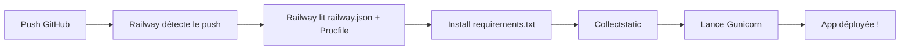
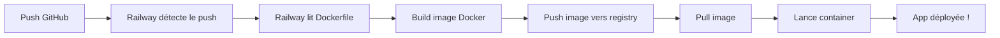

# Railway vs Docker : Quelle approche choisir ?

## 🤔 Qu'est-ce que Railway ?

Railway est un **Platform as a Service (PaaS)** qui déploie ton code directement depuis GitHub. Pense à Railway comme un "Heroku nouvelle génération".

**Fonctionnement :**
1. Tu connectes ton repo GitHub
2. Railway détecte automatiquement le langage (Python/Django)
3. Il build et déploie automatiquement
4. Tu obtiens une URL : `https://ton-app.up.railway.app`

---

## 🆚 Railway (sans Docker) vs Docker

### Option 1 : Railway direct (RECOMMANDÉ pour toi)

**Avantages :**
- ✅ **Zéro config** : Railway détecte Django automatiquement
- ✅ **Simple** : Push sur GitHub → déploiement automatique
- ✅ **Pas besoin de comprendre Docker**
- ✅ **Logs en temps réel** dans l'UI Railway
- ✅ **Rollback facile** : retour à un commit précédent en 1 clic
- ✅ **Variables d'env dans l'UI** : pas besoin de fichier .env

**Inconvénients :**
- ❌ Moins de contrôle sur l'environnement

**Fichiers nécessaires :**
- `railway.json` (optionnel, pour config avancée)
- `Procfile` (liste les commandes à exécuter)
- `nixpacks.toml` (config Python)

✅ **Ces fichiers sont déjà créés pour toi !**

---

### Option 2 : Railway avec Docker

**Avantages :**
- ✅ **Contrôle total** sur l'environnement
- ✅ **Reproductible** : même env partout (local, staging, prod)
- ✅ **Bon pour apps complexes** avec services multiples

**Inconvénients :**
- ❌ **Plus complexe** : tu dois comprendre Docker
- ❌ **Build plus lent** : Docker layers à construire
- ❌ **Plus de fichiers** : Dockerfile, docker-compose.yml, etc.
- ❌ **Debug plus dur** : logs dans les containers

**Fichiers nécessaires :**
- `Dockerfile` (tu l'as déjà dans `backend/`)
- `docker-compose.yml` (tu l'as déjà à la racine)

---

## 🎯 Recommandation pour toi

**→ Utilise Railway SANS Docker (Option 1)**

**Pourquoi ?**
- Tu débutes, pas besoin de complexité
- Railway gère tout pour toi
- Ton app est simple : Django + PostgreSQL
- Tu économises du temps (et donc de l'argent)

**Quand utiliser Docker ?**
- Tu veux un environnement 100% identique local/prod
- Tu as des dépendances système complexes
- Tu veux apprendre Docker (challenge accepté !)
- Tu as besoin de services custom (Redis, Celery, etc.)

---

## 📝 Comparaison technique

| Critère | Railway direct | Railway + Docker |
|---------|----------------|------------------|
| Facilité | ⭐⭐⭐⭐⭐ | ⭐⭐ |
| Vitesse de build | ⭐⭐⭐⭐ | ⭐⭐ |
| Contrôle | ⭐⭐⭐ | ⭐⭐⭐⭐⭐ |
| Debug | ⭐⭐⭐⭐ | ⭐⭐ |
| Coût | Identique | Identique |
| Maintenance | ⭐⭐⭐⭐⭐ | ⭐⭐⭐ |

---

## 🚀 Workflow de déploiement

### Railway direct (choisi pour toi)



**Temps total : ~2-3 minutes**

---

### Railway + Docker



**Temps total : ~5-8 minutes**

---

## 🆘 Bonus : Si tu veux tester Docker plus tard

### 1. Déployer avec Docker sur Railway

**Dans ton repo, crée `railway.dockerfile` :**
```dockerfile
FROM python:3.11-slim

WORKDIR /app

# Install dependencies
COPY backend/requirements/requirements.txt .
RUN pip install --no-cache-dir -r requirements.txt

# Copy code
COPY backend/ .

# Collectstatic
RUN python manage.py collectstatic --noinput

# Run
CMD ["gunicorn", "config.wsgi:application", "--bind", "0.0.0.0:8000", "--workers", "2"]
```

**Railway détectera automatiquement ce Dockerfile.**

### 2. Localement, tester avec Docker Compose

Tu as déjà `docker-compose.yml` et `docker-compose.prod.yml` :

```bash
# Dev local avec Docker
docker-compose up -d

# Prod simulation avec Docker
docker-compose -f docker-compose.prod.yml up -d
```

---

## ✅ Conclusion

**Pour débuter : Railway direct (sans Docker)**
- Simple
- Rapide
- Efficace

**Plus tard : Ajouter Docker**
- Quand ton app grossit
- Quand tu veux apprendre
- Quand tu as besoin de + de contrôle

---

**🎯 TL;DR : Suis le guide `DEPLOY_CHECKLIST.md` et utilise Railway direct (les fichiers sont déjà prêts).**
