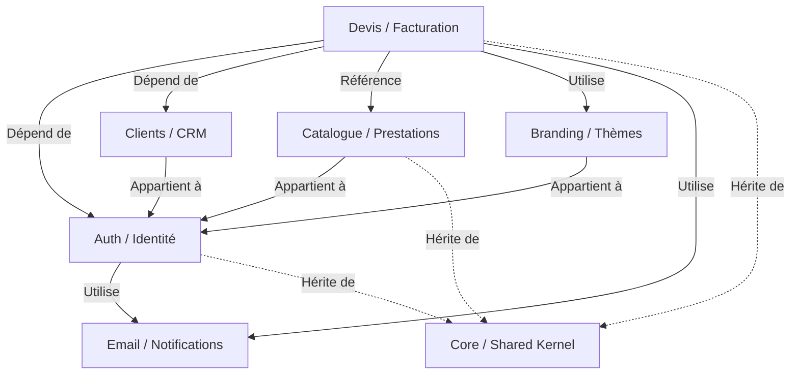
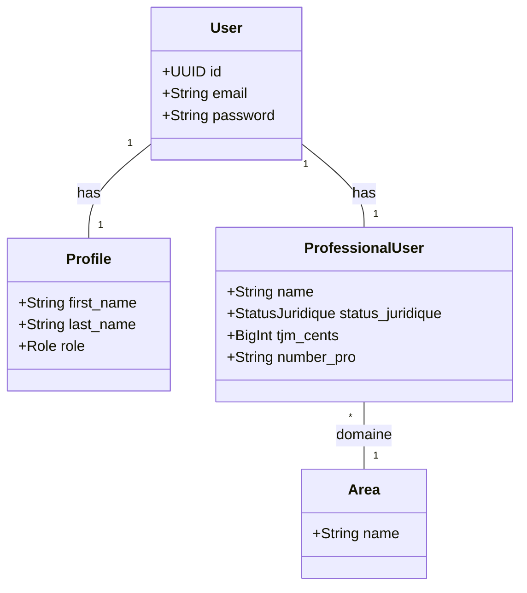
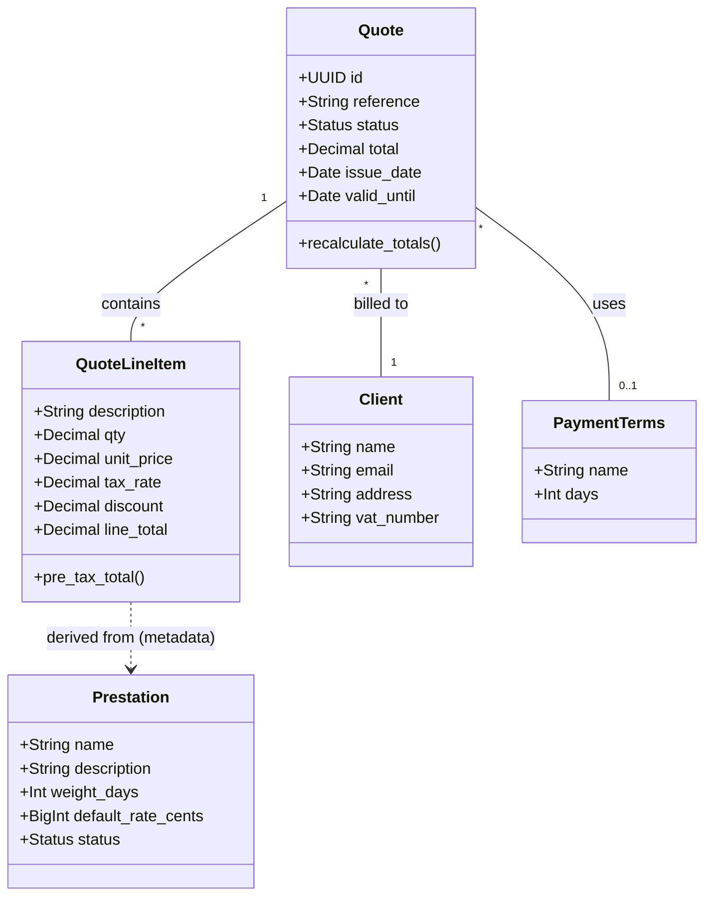
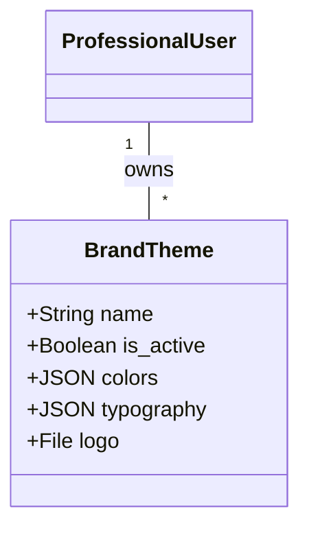
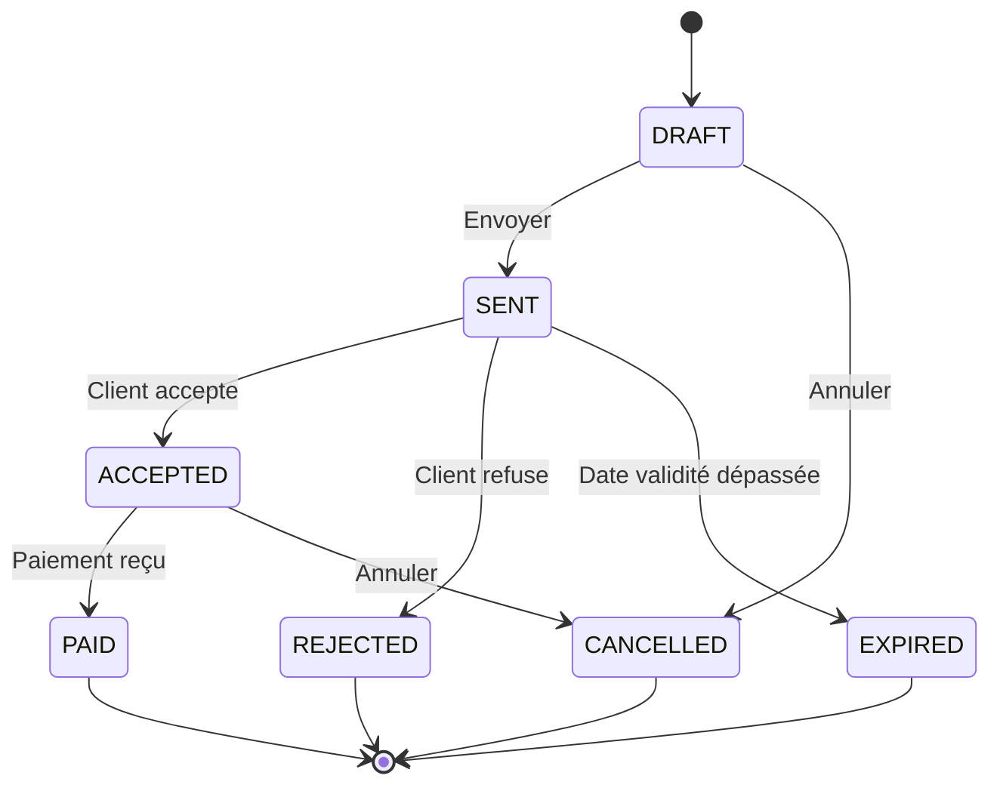
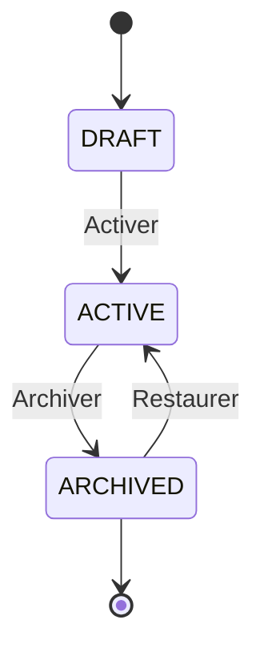
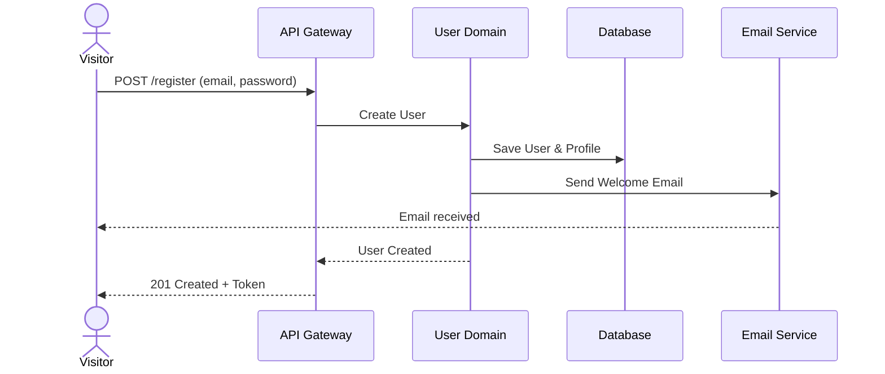
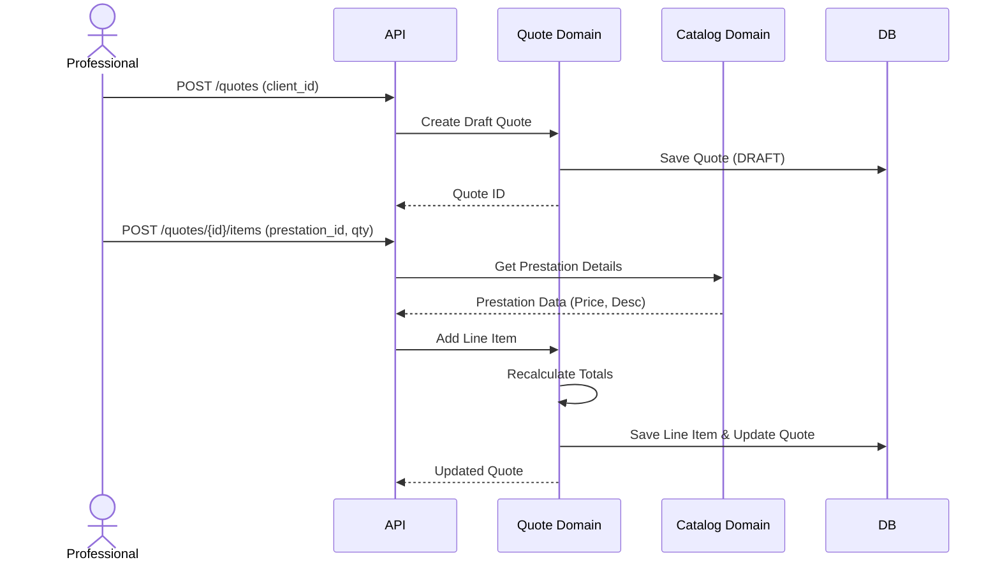

# Architecture FreelanSign

## 1. Context Map (Vue Globale)

Ce diagramme présente les principaux Bounded Contexts de l'application et leurs relations.

## 2. Domain Model (Diagrammes de Classes)

### Auth / Identité / Profil Pro

Gestion des utilisateurs, de leurs profils personnels et de leurs entités professionnelles.

### Devis / Clients / Prestations

Cœur du métier : création de devis pour des clients basés sur des prestations.

### Branding

Personnalisation des documents.

## 3. State Machines (Lifecycles)

### Quote Lifecycle

Cycle de vie d'un devis.

### Prestation Lifecycle

Cycle de vie d'une prestation catalogue.

## 4. Séquences Métier Clés

### Inscription + Démarrage (Simplifié)

### Création d'un Devis

## 5. Éléments Non Résolus / Manquants

Les éléments suivants ont été demandés mais n'ont pas été trouvés dans la base de code actuelle :

- **Billing / Subscription Domain** :
    - Pas de modèles `Plan`, `Subscription`, `Invoice` (pour la facturation de l'abonnement SaaS lui-même) trouvés dans `backend/apps`.
    - Il semble que la gestion des abonnements SaaS (FreelanSign facturant le Freelance) ne soit pas encore implémentée ou se trouve dans un dépôt séparé/module non scanné.
- **CRM Avancé** :
    - Le module `Client` est très simple (Nom, Email, Adresse). Pas de gestion complexe de contacts multiples ou d'historique d'interactions au-delà des devis.
