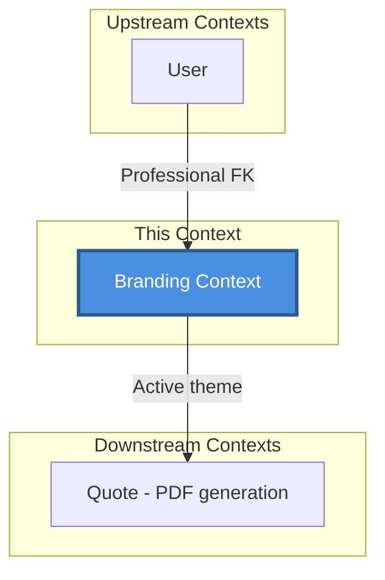
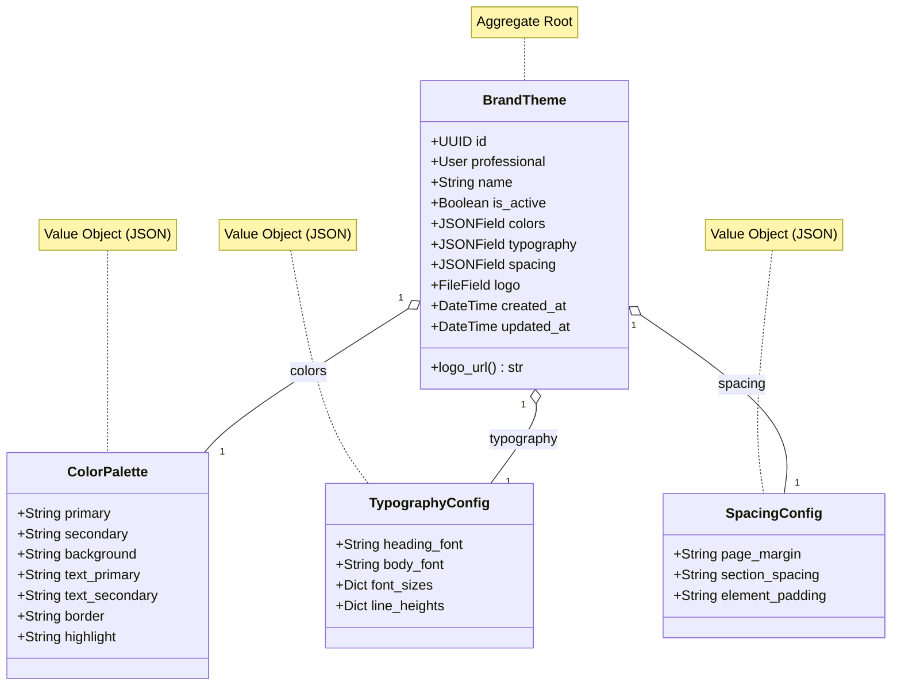
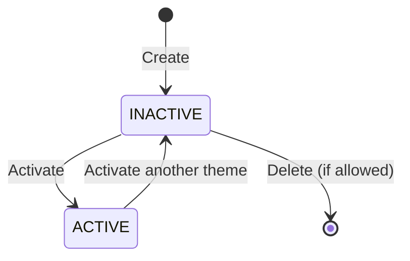

# Branding Context

> 📋 Status: ✅ Stable
>
> 📅 **Dernière mise à jour**: 2025-11-25
>
> 👤 **Owner**: Bertrand Renaudin

---

## 🎯 Responsabilité

Ce contexte gère la personnalisation visuelle des documents générés (devis, factures) : thèmes de marque, palettes de couleurs, typographie, espacements, et logos.

---

## 📖 Ubiquitous Language (Local)

| Terme | Définition | Type | Synonymes à éviter |
|-------|-----------|------|-------------------|
| **BrandTheme** | Thème de marque personnalisé pour documents (couleurs, typo, espacements, logo) | Entity (Aggregate Root) | ≠ Theme, Style |
| **ColorPalette** | Palette de couleurs (primary, secondary, text, background, etc.) | Value Object | - |
| **TypographyConfig** | Configuration typographique (fonts, sizes, line-heights) | Value Object | - |
| **SpacingConfig** | Configuration espacements (margins, padding, sections) | Value Object | - |
| **Active Theme** | Thème actuellement utilisé pour génération PDF | Business Rule | - |

### Distinctions importantes

> 💡 Note: Un seul thème actif par professional à un instant T

- **BrandTheme** est stocké en DB avec JSON pour flexibilité
- **ColorPalette, TypographyConfig, SpacingConfig** = structures JSON validées par domain layer
- Un professional peut avoir plusieurs thèmes mais **1 seul actif**

---

## 🏗️ Architecture

### Position dans le système



### Relations avec autres contextes

| Contexte | Type de relation | Description | Interface |
|----------|-----------------|-------------|-----------|
| **User** | ⬆️ Upstream | Theme appartient à un Professional (User) | `professional: ForeignKey(User, CASCADE)` |
| **Quote** | ⬇️ Downstream | Quote PDF utilise active theme | Theme lookup par professional_id |

---

## 📦 Entités & Agrégats

### Vue d'ensemble



### Liste des entités

| Nom | Type | Description | Implémentation |
|-----|------|-------------|---------------|
| **BrandTheme** | Aggregate Root | Thème de marque avec config visuelle complète | [models.py](file:///Users/bertrandrenaudin/Desktop/DEV/FreelanSign/backend/apps/branding/models.py#L13-L117) |
| **ColorPalette** | Value Object | Palette couleurs stockée en JSON `colors` | [domain/value_objects/color_palette.py](file:///Users/bertrandrenaudin/Desktop/DEV/FreelanSign/backend/apps/branding/domain/value_objects/color_palette.py) |
| **TypographyConfig** | Value Object | Config typo stockée en JSON `typography` | [domain/value_objects/typography_config.py](file:///Users/bertrandrenaudin/Desktop/DEV/FreelanSign/backend/apps/branding/domain/value_objects/typography_config.py) |
| **SpacingConfig** | Value Object | Config espacements stockée en JSON `spacing` | [domain/value_objects/spacing_config.py](file:///Users/bertrandrenaudin/Desktop/DEV/FreelanSign/backend/apps/branding/domain/value_objects/spacing_config.py) |

---

## 📋 Business Rules

### Règles critiques (P0)

| ID | Règle | Implémentation | Tests |
|----|-------|---------------|-------|
| BR-BRAND-001 | Un professional ne peut avoir qu'un seul thème actif à la fois | ✅ `UniqueConstraint(professional, condition=is_active=True)` | ✅ |
| BR-BRAND-002 | Nom de thème unique par professional | ✅ `UniqueConstraint(professional, name)` | ✅ |
| BR-BRAND-003 | Activation d'un thème désactive les autres automatiquement | ✅ `save()` override avec transaction atomic | ✅ |

### Règles importantes (P1)

| ID | Règle | Implémentation | Tests |
|----|-------|---------------|-------|
| BR-BRAND-011 | Colors, typography, spacing doivent respecter schema JSON | ✅ Domain validators | ⚠️ Tests partiels |
| BR-BRAND-012 | Logo optionnel, uploaded to `branding/logos/` | ✅ `FileField(null=True, blank=True)` | ✅ |

---

## 🔄 Use Cases

### Vue d'ensemble

| Use Case | Actor | Trigger | Outcome |
|----------|-------|---------|---------|
| **Create Theme** | User (Pro) | Formulaire nouveau thème | Theme créé, NOT active by default |
| **Activate Theme** | User (Pro) | Activer thème | Theme → is_active=True, autres désactivés |
| **Update Theme** | User (Pro) | Modifier couleurs/typo/logo | Theme.updated_at modifié |
| **Delete Theme** | User (Pro) | Supprimer thème | Theme supprimé (si pas actif ?) |
| **Get Active Theme** | System (Quote PDF) | Génération PDF | Retourne active theme ou default |

### Détails par Use Case

#### 🔹 Activate Theme

**Flow**:
1. Vérifier theme existe et appartient au professional
2. Désactiver tous autres thèmes du professional (transaction atomic)
3. Activer theme cible (is_active=True)
4. Sauvegarder
5. Retourner Theme DTO

**Règles appliquées**: BR-BRAND-001, BR-BRAND-003

**Implémentation**: `apps.branding.application.use_cases.activate_theme` + `BrandTheme.save()` override

---

## 🎛️ États & Transitions

### Diagramme d'états



### Matrice états → actions autorisées

| État | Modifier | Activer | Supprimer | Utiliser pour PDF |
|------|----------|---------|-----------|-------------------|
| **INACTIVE** | ✅ | ✅ | ✅ | ❌ |
| **ACTIVE** | ✅ | ❌ (déjà actif) | ⚠️ (si autre existe) | ✅ |

---

## 🔌 Interface / API

### REST API (Interface Layer)

| Endpoint | Method | Description | Auth |
|----------|--------|-------------|------|
| `/branding/themes/` | GET | Liste thèmes du professional | User (Pro) |
| `/branding/themes/` | POST | Créer thème | User (Pro) |
| `/branding/themes/{id}/` | GET | Détail thème | User (Pro, owner) |
| `/branding/themes/{id}/` | PATCH | Modifier thème | User (Pro, owner) |
| `/branding/themes/{id}/activate/` | POST | Activer thème | User (Pro, owner) |
| `/branding/themes/{id}/` | DELETE | Supprimer thème | User (Pro, owner) |
| `/branding/themes/active/` | GET | Récupérer thème actif | User (Pro) |

**Exemple requête (Create Theme)**:

```json
POST /api/branding/themes/
Authorization: Bearer {token}
Content-Type: application/json

{
  "name": "Modern Blue",
  "colors": {
    "primary": "#3B82F6",
    "secondary": "#10B981",
    "background": "#FFFFFF",
    "text_primary": "#1F2937",
    "text_secondary": "#6B7280",
    "border": "#E5E7EB",
    "highlight": "#FCD34D"
  },
  "typography": {
    "heading_font": "Inter",
    "body_font": "Roboto",
    "font_sizes": {
      "h1": "32px",
      "h2": "24px",
      "body": "14px"
    },
    "line_heights": {
      "heading": "1.2",
      "body": "1.6"
    }
  },
  "spacing": {
    "page_margin": "20mm",
    "section_spacing": "10mm",
    "element_padding": "5mm"
  }
}
```

**Exemple réponse**:

```json
{
  "id": "uuid-theme",
  "name": "Modern Blue",
  "is_active": false,
  "colors": { ... },
  "typography": { ... },
  "spacing": { ... },
  "logo_url": null,
  "created_at": "2025-11-25T10:00:00Z",
  "updated_at": "2025-11-25T10:00:00Z"
}
```

---

## 📨 Événements Domaine

### Événements émis

| Événement | Trigger | Payload | Consommateurs |
|-----------|---------|---------|---------------|
| `ThemeCreated` | Create theme | `{theme_id, professional_id}` | Analytics |
| `ThemeActivated` | Activate theme | `{theme_id, professional_id}` | Analytics, Cache invalidation |
| `ThemeUpdated` | Update theme | `{theme_id, updated_fields}` | Analytics |
| `ThemeDeleted` | Delete theme | `{theme_id}` | Analytics |

### Événements consommés

Aucun.

---

## 📚 Ressources

### Code

- **Backend**: [backend/apps/branding/](file:///Users/bertrandrenaudin/Desktop/DEV/FreelanSign/backend/apps/branding)
- **Models**: [models.py](file:///Users/bertrandrenaudin/Desktop/DEV/FreelanSign/backend/apps/branding/models.py)
- **Domain**: [domain/](file:///Users/bertrandrenaudin/Desktop/DEV/FreelanSign/backend/apps/branding/domain)
  - [value_objects/color_palette.py](file:///Users/bertrandrenaudin/Desktop/DEV/FreelanSign/backend/apps/branding/domain/value_objects/color_palette.py)
  - [value_objects/typography_config.py](file:///Users/bertrandrenaudin/Desktop/DEV/FreelanSign/backend/apps/branding/domain/value_objects/typography_config.py)
  - [value_objects/spacing_config.py](file:///Users/bertrandrenaudin/Desktop/DEV/FreelanSign/backend/apps/branding/domain/value_objects/spacing_config.py)
- **Application**: [application/](file:///Users/bertrandrenaudin/Desktop/DEV/FreelanSign/backend/apps/branding/application)
- **Tests**: [tests/](file:///Users/bertrandrenaudin/Desktop/DEV/FreelanSign/backend/apps/branding/tests)

---

## 📝 Changelog

| Date | Version | Changement | Auteur |
|------|---------|-----------|--------|
| 2025-11-25 | 0.2.0 | Documentation initiale contexte Branding | Bertrand Renaudin |

---

## 🔍 Gaps, Manques & Suggestions

> Section ajoutée pour identifier les améliorations potentielles

### Gaps identifiés

1. **JSON Schema validation**: Colors, typography, spacing ne sont pas validés avec JSONSchema strict. Risque de données inconsistantes.

2. **Default theme creation**: Pas de création automatique d'un thème par défaut lors de signup professional.

3. **Theme preview**: Pas d'endpoint de prévisualisation PDF avec thème avant activation.

4. **Logo validation**: Pas de validation format/taille logo (PNG/JPG/SVG, max size).

5. **Theme versioning**: Si theme actif modifié, quotes PDF déjà générés changent rétroactivement ?

### Manques documentation

1. **Domain services**: `ThemeValidator`, `ThemeNormalizer`, `ThemePolicy` existent mais non détaillés.

2. **PDF rendering integration**: Comment Quote context utilise BrandTheme pour générer PDF ?

3. **Color format**: Hex, RGB, HSL supportés ? Validation format ?

4. **Font loading**: Comment fonts custom (Google Fonts, etc.) sont-ils chargés pour PDF ?

### Suggestions

1. **Theme marketplace**: Templates de thèmes pré-faits pour accélérer setup.

2. **Theme duplication**: Dupliquer thème existant comme point de départ.

3. **Theme import/export**: Export theme en JSON pour partage/backup.

4. **Dark mode support**: Palette couleurs alternative pour mode sombre.

5. **Advanced customization**:
   - Border radius config
   - Shadow config
   - Custom CSS injection (avancé)

6. **Theme history**: Versionner modifications theme pour rollback.

7. **A/B testing**: Tester plusieurs thèmes pour voir impact conversion quotes.

8. **Brand assets library**: Stocker plusieurs logos, images custom pour réutilisation.

9. **Color accessibility check**: Valider contraste couleurs (WCAG AA/AAA).

10. **PDF caching**: Cache PDF avec hash theme pour éviter régénération si theme inchangé.
