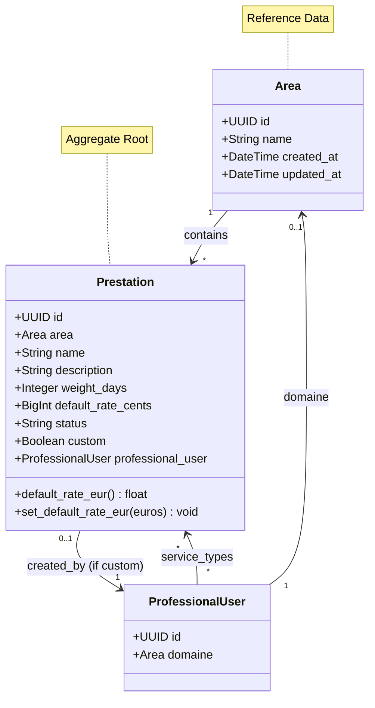
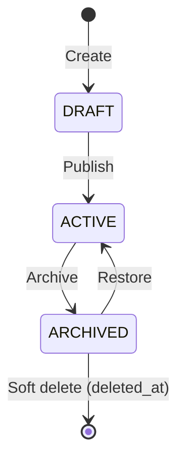

# Catalog Context

> 📋 Status: ✅ Stable
>
> 📅 **Dernière mise à jour**: 2025-11-25
>
> 👤 **Owner**: Bertrand Renaudin

---

## 🎯 Responsabilité

Ce contexte gère le catalogue de services/prestations : domaines d'activité (Areas), prestations standards et personnalisées, tarifs par défaut, durées estimées.

---

## 📖 Ubiquitous Language (Local)

| Terme | Définition | Type | Synonymes à éviter |
|-------|-----------|------|-------------------|
| **Area** | Domaine d'activité professionnel (ex: Développement Web, Design, Marketing) | Entity (Reference Data) | ≠ Category, Domain |
| **Prestation** | Service/prestation facturable avec tarif et durée estimée | Entity (Aggregate Root) | ≠ Service, Offering |
| **Custom Prestation** | Prestation créée par un professional (non partagée globalement) | Entity | ≠ Global Prestation |
| **PrestationStatus** | Statut prestation (DRAFT, ACTIVE, ARCHIVED) | Value Object (Enum) | - |
| **Weight Days** | Durée moyenne en jours-homme pour exécuter la prestation | Value Object | ≠ Duration |
| **Default Rate** | Tarif par défaut de la prestation (stocké en centimes) | Value Object | - |

### Distinctions importantes

> 💡 Note: Distinction prestations globales vs custom (par professional)

- **Global Prestation** : `professional_user=NULL`, partagée entre tous les professionals du même Area
- **Custom Prestation** : `professional_user!=NULL`, visible uniquement par ce professional
- **Area** : Référence data, pas de propriétaire, utilisée comme classification
- **Weight Days** : Estimation par défaut, peut être override dans Quote line

---

## 🏗️ Architecture

### Position dans le système

```mermaid
graph TB
    subgraph "Upstream Contexts"
        U1[User - ProfessionalUser]
    end

    subgraph "This Context"
        CAT[Catalog Context]
    end

    subgraph "Downstream Contexts"
        D1[Quote - LineItem metadata]
        D2[User - service_types M2M]
    end

    U1 -->|Professional FK (custom prestations)| CAT
    CAT -->|Prestation metadata| D1
    CAT -.->|Bidirectional M2M| D2

    style CAT fill:#4A90E2,stroke:#2E5C8A,stroke-width:3px,color:#fff
```

### Relations avec autres contextes

| Contexte | Type de relation | Description | Interface |
|----------|-----------------|-------------|-----------|
| **User** | 🤝 Partner (bidirectional) | ProfessionalUser.domaine → Area, ProfessionalUser.service_types → Prestation M2M | FK + M2M |
| **Quote** | ⬇️ Downstream | QuoteLineItem stocke référence prestation en metadata JSON | JSON metadata |

---

## 📦 Entités & Agrégats

### Vue d'ensemble



### Liste des entités

| Nom | Type | Description | Implémentation |
|-----|------|-------------|---------------|
| **Area** | Reference Data | Domaine d'activité (unique name) | [models.py](file:///Users/bertrandrenaudin/Desktop/DEV/FreelanSign/backend/apps/catalog/models.py#L9-L18) |
| **Prestation** | Aggregate Root | Service facturable avec tarif/durée, global ou custom | [models.py](file:///Users/bertrandrenaudin/Desktop/DEV/FreelanSign/backend/apps/catalog/models.py#L27-L97) |
| **PrestationStatus** | Value Object (Enum) | DRAFT, ACTIVE, ARCHIVED | [models.py](file:///Users/bertrandrenaudin/Desktop/DEV/FreelanSign/backend/apps/catalog/models.py#L21-L24) |

---

## 📋 Business Rules

### Règles critiques (P0)

| ID | Règle | Implémentation | Tests |
|----|-------|---------------|-------|
| BR-CAT-001 | Prestation globale (area, name) unique | ✅ `UniqueConstraint(area, name, condition=professional_user IS NULL)` | ✅ |
| BR-CAT-002 | Prestation custom (professional, name) unique | ✅ `UniqueConstraint(professional_user, name, condition!=NULL)` | ✅ |
| BR-CAT-003 | Weight_days >= 0 | ✅ `CheckConstraint(weight_days__gte=0)` | ✅ |
| BR-CAT-004 | Default_rate_cents >= 0 | ✅ `CheckConstraint(default_rate_cents__gte=0)` | ✅ |
| BR-CAT-005 | Area name unique | ✅ `unique=True` | ✅ |

### Règles importantes (P1)

| ID | Règle | Implémentation | Tests |
|----|-------|---------------|-------|
| BR-CAT-011 | Prestation soft delete (`deleted_at`) | ✅ `SoftDeleteModel` mixin | ✅ |
| BR-CAT-012 | Custom prestation uniquement si professional_user set | ✅ Logic application layer | ⚠️ Contrainte DB TODO |

---

## 🔄 Use Cases

### Vue d'ensemble

| Use Case | Actor | Trigger | Outcome |
|----------|-------|---------|---------|
| **List Global Prestations** | User (Pro) | Browse catalog | Prestations globales de l'Area |
| **Create Custom Prestation** | User (Pro) | Formulaire ajout prestation | Prestation custom créée |
| **Update Prestation** | User (Pro) | Modifier prestation custom | Prestation.updated_at modifié |
| **Archive Prestation** | User (Pro) | Archiver | Status → ARCHIVED (soft delete) |
| **Add Prestation to Quote Line** | System | Quote line creation | Metadata JSON avec prestation référence |
| **List Areas** | System | Signup / Profile setup | Liste areas pour sélection domaine |

### Détails par Use Case

#### 🔹 Create Custom Prestation

**Flow**:
1. Valider professional_user existe
2. Valider nom unique pour ce professional
3. Valider default_rate_cents, weight_days >= 0
4. Créer Prestation avec custom=True
5. Status = DRAFT par défaut
6. Retourner Prestation DTO

**Règles appliquées**: BR-CAT-002, BR-CAT-003, BR-CAT-004

**Implémentation**: `apps.catalog.application.use_cases.create_custom_prestation`

#### 🔹 Add Prestation to Quote Line

**Flow**:
1. User sélectionne prestation (global ou custom)
2. QuoteLineItem créé avec :
   - `description` = prestation.name
   - `unit_price` = prestation.default_rate_cents / 100
   - `qty` = prestation.weight_days (ou override)
   - `metadata` = `{"prestation_id": uuid, "prestation_name": name, "area_key": area.name}`
3. Metadata permet traçabilité même si prestation modifiée/supprimée

**Règles appliquées**: Aucune contrainte stricte (metadata informationnel)

---

## 🎛️ États & Transitions

### Diagramme d'états (Prestation)



---

## 🔌 Interface / API

### REST API (Interface Layer)

| Endpoint | Method | Description | Auth |
|----------|--------|-------------|------|
| `/catalog/areas/` | GET | Liste areas | Public ou User |
| `/catalog/prestations/` | GET | Liste prestations (global + custom user) | User (Pro) |
| `/catalog/prestations/` | POST | Créer prestation custom | User (Pro) |
| `/catalog/prestations/{id}/` | GET | Détail prestation | User |
| `/catalog/prestations/{id}/` | PATCH | Modifier prestation custom | User (Pro, owner) |
| `/catalog/prestations/{id}/archive/` | POST | Archiver prestation | User (Pro, owner) |

**Exemple requête (Create Custom Prestation)**:

```json
POST /api/catalog/prestations/
Authorization: Bearer {token}
Content-Type: application/json

{
  "area_id": "uuid-area",
  "name": "Audit SEO Approfondi",
  "description": "Audit complet SEO technique + contenu + netlinking",
  "weight_days": 5,
  "default_rate_eur": 2500.00,
  "status": "ACTIVE"
}
```

**Exemple réponse**:

```json
{
  "id": "uuid-prestation",
  "area": {
    "id": "uuid-area",
    "name": "Marketing Digital"
  },
  "name": "Audit SEO Approfondi",
  "description": "Audit complet SEO technique + contenu + netlinking",
  "weight_days": 5,
  "default_rate_cents": 250000,
  "default_rate_eur": 2500.00,
  "status": "ACTIVE",
  "custom": true,
  "created_at": "2025-11-25T10:00:00Z"
}
```

---

## 📨 Événements Domaine

### Événements émis

| Événement | Trigger | Payload | Consommateurs |
|-----------|---------|---------|---------------|
| `PrestationCreated` | Create prestation | `{prestation_id, professional_id, custom}` | Analytics |
| `PrestationUpdated` | Update prestation | `{prestation_id, updated_fields}` | Analytics |
| `PrestationArchived` | Archive prestation | `{prestation_id}` | Analytics |

### Événements consommés

Aucun.

---

## 📚 Ressources

### Code

- **Backend**: [backend/apps/catalog/](file:///Users/bertrandrenaudin/Desktop/DEV/FreelanSign/backend/apps/catalog)
- **Models**: [models.py](file:///Users/bertrandrenaudin/Desktop/DEV/FreelanSign/backend/apps/catalog/models.py)
- **Domain**: [domain/](file:///Users/bertrandrenaudin/Desktop/DEV/FreelanSign/backend/apps/catalog/domain)
- **Application**: [application/](file:///Users/bertrandrenaudin/Desktop/DEV/FreelanSign/backend/apps/catalog/application)
- **Tests**: [tests/](file:///Users/bertrandrenaudin/Desktop/DEV/FreelanSign/backend/apps/catalog/tests)

---

## 📝 Changelog

| Date | Version | Changement | Auteur |
|------|---------|-----------|--------|
| 2025-11-25 | 0.2.0 | Documentation initiale contexte Catalog | Bertrand Renaudin |

---

## 🔍 Gaps, Manques & Suggestions

> Section ajoutée pour identifier les améliorations potentielles

### Gaps identifiés

1. **Area hierarchy**: Pas de support sous-catégories (ex: Area "Dev" → Sub "Frontend", "Backend").

2. **Prestation templates**: Pas de système de templates de prestations réutilisables.

3. **Price history**: Modifications default_rate_cents non historisées. Impact retroactif ?

4. **Catalog versioning**: Si prestation globale modifiée, impact sur quotes existants ?

5. **Custom flag validation**: Pas de contrainte DB garantissant `custom=True <=> professional_user IS NOT NULL`.

### Manques documentation

1. **Domain services**: `PrestationCalculator`, `PrestationPolicy` existent mais non détaillés.

2. **Import catalog**: Workflow d'import prestations en masse (CSV/JSON) non documenté.

3. **Prestation recommendations**: Suggestions prestations selon domaine/historique.

4. **Search/filters**: Full-text search sur prestations, filtres avancés.

### Suggestions

1. **Value Objects**:
   - `WeightDays` avec validation > 0
   - `Money` pour `default_rate_cents`
   - `PrestationName` avec validation format

2. **Prestation bundles**: Grouper plusieurs prestations en package avec tarif réduit.

3. **Seasonal pricing**: Tarifs variables selon période (haute/basse saison).

4. **Prestation tags**: Système de tags pour recherche avancée.

5. **Prestation reviews**: Feedback clients sur prestations pour amélioration.

6. **Catalog sharing**: Partager catalog custom entre plusieurs professionals (équipe).

7. **Prestation variants**: Variantes d'une prestation (Basic, Standard, Premium).

8. **Usage analytics**: Prestations les plus utilisées, CA par prestation.

9. **Prestation dependencies**: Certaines prestations requièrent d'autres (ex: "Maintenance" requiert "Développement initial").

10. **Multi-currency support**: Default_rate_cents en plusieurs devises.

11. **Procurement integration**: Lier prestations à fournisseurs externes si sous-traitance.

12. **Prestation lifecycle alerts**: Notification si prestation non utilisée depuis X mois → suggérer archivage.
