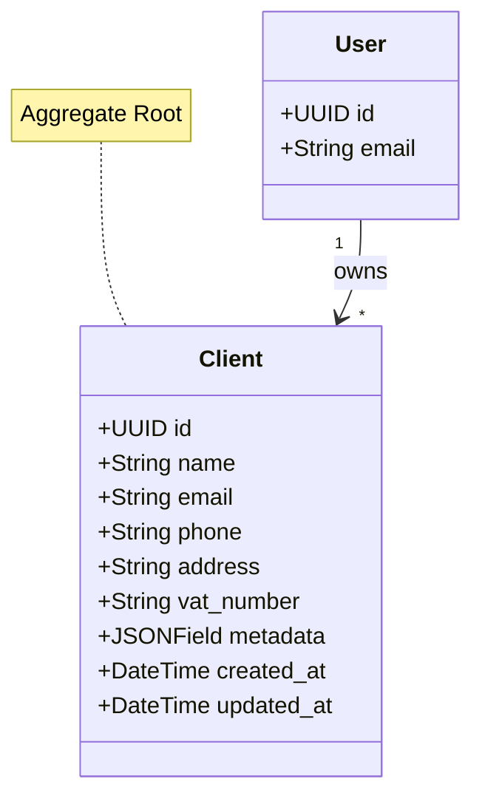

# Client Context

> 📋 Status: ✅ Stable
>
> 📅 **Dernière mise à jour**: 2025-11-25
>
> 👤 **Owner**: Bertrand Renaudin

---

## 🎯 Responsabilité

Ce contexte gère les clients des freelances : création, modification, stockage des informations de contact et facturation.

---

## 📖 Ubiquitous Language (Local)

| Terme | Définition | Type | Synonymes à éviter |
|-------|-----------|------|-------------------|
| **Client** | Entreprise ou personne pour qui le freelance réalise des devis/factures | Entity (Aggregate Root) | ≠ Customer, Contact |
| **Owner** | Freelance propriétaire de la fiche client | Reference (User) | - |
| **VAT Number** | Numéro de TVA intracommunautaire du client | Value Object | - |

### Distinctions importantes

> 💡 Note: Un Client appartient toujours à un Owner (User freelance)

- **Client** ≠ User : Client = tiers externe, User = utilisateur FreelanSign
- **Owner** : Référence au User freelance qui gère ce client

---

## 🏗️ Architecture

### Position dans le système

```mermaid
graph TB
    subgraph "Upstream Contexts"
        U1[User]
    end

    subgraph "This Context"
        CC[Client Context]
    end

    subgraph "Downstream Contexts"
        D1[Quote]
    end

    U1 -->|Owner (User FK)| CC
    CC -->|Client FK| D1

    style CC fill:#4A90E2,stroke:#2E5C8A,stroke-width:3px,color:#fff
```

### Relations avec autres contextes

| Contexte | Type de relation | Description | Interface |
|----------|-----------------|-------------|-----------|
| **User** | ⬆️ Upstream | Client appartient à un User | `owner: ForeignKey(User)` |
| **Quote** | ⬇️ Downstream | Quote référence un Client | Client FK dans Quote |

---

## 📦 Entités & Agrégats

### Vue d'ensemble



### Liste des entités

| Nom | Type | Description | Implémentation |
|-----|------|-------------|---------------|
| **Client** | Aggregate Root | Fiche client avec coordonnées et infos facturation | [models.py](file:///Users/bertrandrenaudin/Desktop/DEV/FreelanSign/backend/apps/client/models.py#L8-L37) |

---

## 📋 Business Rules

### Règles critiques (P0)

| ID | Règle | Implémentation | Tests |
|----|-------|---------------|-------|
| BR-CLIENT-001 | Un Client appartient obligatoirement à un Owner (User) | ✅ `owner: ForeignKey(User, on_delete=CASCADE)` | ✅ |
| BR-CLIENT-002 | Un Client a un nom obligatoire non vide | ✅ `name: CharField(max_length=255)` | ✅ |
| BR-CLIENT-003 | Un Client ne peut être supprimé si quotes attachés | ✅ `Quote.client: PROTECT` | ✅ |

### Règles importantes (P1)

| ID | Règle | Implémentation | Tests |
|----|-------|---------------|-------|
| BR-CLIENT-011 | Email/phone/address/vat_number optionnels | ✅ `blank=True` sur champs | ✅ |
| BR-CLIENT-012 | Metadata JSON pour extensibilité future | ✅ `metadata: JSONField(default=dict)` | ⚠️ Schema TODO |

---

## 🔄 Use Cases

### Vue d'ensemble

| Use Case | Actor | Trigger | Outcome |
|----------|-------|---------|---------|
| **Create Client** | User | Formulaire client | Client créé, lié à owner |
| **Update Client** | User | Edit client form | Client.updated_at modifié |
| **Delete Client** | User | Delete action | Client supprimé (si aucun Quote) |
| **List Clients** | User | Clients page | Liste clients de l'owner |
| **Search Client** | User | Search bar | Filtrage par nom/email |

### Détails par Use Case

#### 🔹 Create Client

**Flow**:
1. Valider nom non vide
2. Valider owner existe
3. Créer Client avec owner_id
4. Retourner Client DTO

**Règles appliquées**: BR-CLIENT-001, BR-CLIENT-002

**Implémentation**: `apps.client.application.use_cases.create_client`

---

## 🎛️ États & Transitions

Pas de machine à états explicite (Client est toujours ACTIVE ou supprimé).

---

## 🔌 Interface / API

### REST API (Interface Layer)

| Endpoint | Method | Description | Auth |
|----------|--------|-------------|------|
| `/clients/` | GET | Liste clients de l'owner | User |
| `/clients/` | POST | Créer client | User |
| `/clients/{id}/` | GET | Détail client | User (owner only) |
| `/clients/{id}/` | PATCH | Modifier client | User (owner only) |
| `/clients/{id}/` | DELETE | Supprimer client | User (owner only) |

**Exemple requête**:

```json
POST /api/clients/
Authorization: Bearer {token}
Content-Type: application/json

{
  "name": "ACME Corp",
  "email": "contact@acme.com",
  "phone": "+33 1 23 45 67 89",
  "address": "123 Rue de la Paix, 75001 Paris",
  "vat_number": "FR12345678901"
}
```

**Exemple réponse**:

```json
{
  "id": "uuid-here",
  "name": "ACME Corp",
  "email": "contact@acme.com",
  "phone": "+33 1 23 45 67 89",
  "address": "123 Rue de la Paix, 75001 Paris",
  "vat_number": "FR12345678901",
  "metadata": {},
  "created_at": "2025-11-25T10:00:00Z",
  "updated_at": "2025-11-25T10:00:00Z"
}
```

---

## 📨 Événements Domaine

### Événements émis

| Événement | Trigger | Payload | Consommateurs |
|-----------|---------|---------|---------------|
| `ClientCreated` | Client création | `{client_id, owner_id, name}` | Analytics |
| `ClientUpdated` | Client modification | `{client_id, updated_fields}` | Analytics |
| `ClientDeleted` | Client suppression | `{client_id, owner_id}` | Analytics |

### Événements consommés

Aucun.

---

## 📚 Ressources

### Code

- **Backend**: [backend/apps/client/](file:///Users/bertrandrenaudin/Desktop/DEV/FreelanSign/backend/apps/client)
- **Models**: [models.py](file:///Users/bertrandrenaudin/Desktop/DEV/FreelanSign/backend/apps/client/models.py)
- **Domain**: [domain/](file:///Users/bertrandrenaudin/Desktop/DEV/FreelanSign/backend/apps/client/domain)
- **Application**: [application/](file:///Users/bertrandrenaudin/Desktop/DEV/FreelanSign/backend/apps/client/application)
- **Tests**: [tests/](file:///Users/bertrandrenaudin/Desktop/DEV/FreelanSign/backend/apps/client/tests)

---

## 📝 Changelog

| Date | Version | Changement | Auteur |
|------|---------|-----------|--------|
| 2025-11-25 | 0.2.0 | Documentation initiale contexte Client | Bertrand Renaudin |

---

## 🔍 Gaps, Manques & Suggestions

> Section ajoutée pour identifier les améliorations potentielles

### Gaps identifiés

1. **Validation VAT number**: Format de numéro TVA non validé. Ajouter regex/validation selon pays.

2. **Duplicate detection**: Pas de contrainte unicité sur `(owner, name)` ou `(owner, email)`. Risque de doublons.

3. **Soft delete**: Pas de mécanisme soft delete. Considérer `SoftDeleteModel` pour archivage.

4. **Address structure**: Champ `address` en TextField libre. Considérer structure (rue, ville, CP, pays).

### Manques documentation

1. **Domain policies**: `ClientPolicies` existe mais non détaillé ici.

2. **Client import/export**: Workflow d'import CSV non documenté.

3. **Client history**: Pas d'audit log des modifications client.

### Suggestions

1. **Value Objects**: `Address`, `VATNumber`, `Email`, `Phone` comme VO typés avec validation.

2. **Client tags/categories**: Ajouter système de catégorisation pour filtres avancés.

3. **Client contacts multiples**: Supporter plusieurs contacts par client (non juste 1 email/phone).

4. **Search index**: Ajouter index full-text sur name/email pour performance search.

5. **Client stats**: Lien vers stats (nb devis, CA total) pour vision business.

6. **RGPD compliance**: Ajouter mécanisme export données client, anonymisation, consentement.
