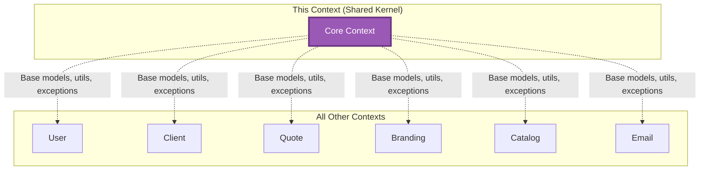

# Core Context

> 📋 Status: ✅ Stable
>
> 📅 **Dernière mise à jour**: 2025-11-25
>
> 👤 **Owner**: Bertrand Renaudin

---

## 🎯 Responsabilité

Ce contexte fournit les utilitaires, modèles de base, exceptions, middlewares, et helpers réutilisables à tous les autres bounded contexts.

---

## 📖 Ubiquitous Language (Local)

| Terme | Définition | Type | Synonymes à éviter |
|-------|-----------|------|-------------------|
| **TimestampedModel** | Abstract model avec created_at/updated_at automatiques | Base Model | - |
| **SoftDeleteModel** | Abstract model avec soft delete (deleted_at) | Base Model | - |
| **BusinessException** | Exception métier custom avec code/message | Exception | ≠ Technical Exception |
| **Money** | Value Object pour montants monétaires (cents ↔ euros) | Value Object | - |

### Distinctions importantes

> 💡 Note: Core ne contient pas de logique métier spécifique, uniquement des utilitaires génériques

- **Core** = Shared Kernel, utilisé par tous les contexts
- **Exceptions** : Business (attendues, gérables) vs Technical (bugs)
- **Models** : Abstract base classes, pas de tables DB directes

---

## 🏗️ Architecture

### Position dans le système



### Relations avec autres contextes

| Contexte | Type de relation | Description | Interface |
|----------|-----------------|-------------|-----------|
| **ALL** | ⬇️ Shared Kernel | Tous les contexts utilisent Core | Inherit base models, import utils |

---

## 📦 Entités & Agrégats

### Composants clés

| Nom | Type | Description | Implémentation |
|-----|------|-------------|---------------|
| **TimestampedModel** | Abstract Model | Base avec created_at, updated_at auto | [models/](file:///Users/bertrandrenaudin/Desktop/DEV/FreelanSign/backend/apps/core/models) |
| **SoftDeleteModel** | Abstract Model | Base avec deleted_at pour soft delete | [models/](file:///Users/bertrandrenaudin/Desktop/DEV/FreelanSign/backend/apps/core/models) |
| **Money utils** | Utility Functions | Conversion euros ↔ cents | [utils/money.py](file:///Users/bertrandrenaudin/Desktop/DEV/FreelanSign/backend/apps/core/utils) |
| **BusinessException** | Exception Base Class | Exceptions métier typées | [exceptions.py](file:///Users/bertrandrenaudin/Desktop/DEV/FreelanSign/backend/apps/core/exceptions.py) |
| **Custom Permissions** | DRF Permissions | Permissions réutilisables (IsOwner, etc.) | [permissions.py](file:///Users/bertrandrenaudin/Desktop/DEV/FreelanSign/backend/apps/core/permissions.py) |
| **Managers** | QuerySet Managers | Managers réutilisables (SoftDeleteManager) | [managers.py](file:///Users/bertrandrenaudin/Desktop/DEV/FreelanSign/backend/apps/core/managers.py) |
| **Enums** | Global Enums | Enums partagés (si applicable) | [enums.py](file:///Users/bertrandrenaudin/Desktop/DEV/FreelanSign/backend/apps/core/enums.py) |

---

## 📋 Business Rules

Aucune business rule spécifique (utilitaires génériques uniquement).

---

## 🔄 Use Cases

Aucun use case (contexte technique, pas métier).

---

## 🔌 Interface / API

### Utilities API

**Money utils**:
```python
from apps.core.utils.money import cents_to_euros, euros_to_cents

# Convert 120000 cents → 1200.00 euros
euros = cents_to_euros(120000)  # 1200.0

# Convert 1200.00 euros → 120000 cents
cents = euros_to_cents(Decimal("1200.00"))  # 120000
```

**TimestampedModel**:
```python
from apps.core.models import TimestampedModel

class MyModel(TimestampedModel):
    # Automatically gets:
    # - created_at: DateTimeField(auto_now_add=True)
    # - updated_at: DateTimeField(auto_now=True)
    pass
```

**SoftDeleteModel**:
```python
from apps.core.models import SoftDeleteModel

class MyModel(SoftDeleteModel):
    # Automatically gets:
    # - deleted_at: DateTimeField(null=True, blank=True)
    # - objects: SoftDeleteManager (filters out deleted)
    # - all_objects: Manager (includes deleted)
    pass

# Usage
obj.delete()  # Sets deleted_at = now()
MyModel.objects.all()  # Excludes deleted
MyModel.all_objects.all()  # Includes deleted
```

**BusinessException**:
```python
from apps.core.exceptions import BusinessException

class QuotaExceededException(BusinessException):
    code = "QUOTA_EXCEEDED"
    message = "You have exceeded your monthly quota."

# Usage
if quota_exceeded:
    raise QuotaExceededException()
```

---

## 📨 Événements Domaine

Aucun événement (utilitaires génériques).

---

## 📚 Ressources

### Code

- **Backend**: [backend/apps/core/](file:///Users/bertrandrenaudin/Desktop/DEV/FreelanSign/backend/apps/core)
- **Models**: [models/](file:///Users/bertrandrenaudin/Desktop/DEV/FreelanSign/backend/apps/core/models)
- **Utils**: [utils/](file:///Users/bertrandrenaudin/Desktop/DEV/FreelanSign/backend/apps/core/utils)
- **Exceptions**: [exceptions.py](file:///Users/bertrandrenaudin/Desktop/DEV/FreelanSign/backend/apps/core/exceptions.py)
- **Permissions**: [permissions.py](file:///Users/bertrandrenaudin/Desktop/DEV/FreelanSign/backend/apps/core/permissions.py)
- **Managers**: [managers.py](file:///Users/bertrandrenaudin/Desktop/DEV/FreelanSign/backend/apps/core/managers.py)
- **Tests**: [tests/](file:///Users/bertrandrenaudin/Desktop/DEV/FreelanSign/backend/apps/core/tests)

---

## 📝 Changelog

| Date | Version | Changement | Auteur |
|------|---------|-----------|--------|
| 2025-11-25 | 0.2.0 | Documentation initiale contexte Core | Bertrand Renaudin |

---

## 🔍 Gaps, Manques & Suggestions

> Section ajoutée pour identifier les améliorations potentielles

### Gaps identifiés

1. **Logging standardization**: Pas de logger configuré réutilisable avec format standard.

2. **Timezone consistency**: Django timezone settings doivent être vérifiés (UTC vs local).

3. **Money VO**: Conversion cents ↔ euros existe mais pas de Value Object typé `Money(amount, currency)`.

4. **Validation helpers**: Pas de validators réutilisables (email, phone, VAT, etc.).

5. **Pagination standardization**: Pas de pagination class custom réutilisable.

### Manques documentation

1. **Middleware**: Middleware custom non documenté ici.

2. **Custom managers**: `SoftDeleteManager` existe mais détails non fournis.

3. **Exception handling**: Strategy de gestion exceptions globale (DRF exception handler custom ?).

4. **Testing utilities**: Test factories, fixtures partagés ?

### Suggestions

1. **Value Objects library**:
   - `Email(value)`
   - `Phone(value, country)`
   - `Money(amount_cents, currency)`
   - `VATNumber(value, country)`
   - `Address(street, city, postal_code, country)`

2. **Result pattern**: `Result[T, E]` pour éviter exceptions en domain layer.

3. **Audit log mixin**: `AuditedModel` avec actor/timestamp pour toute modification.

4. **UUID generator**: Custom UUID generator avec prefixes (ex: `usr_`, `quo_`, `cli_`).

5. **Feature flags**: Système feature flags réutilisable (ex: `is_feature_enabled("custom_branding")`).

6. **Rate limiting**: Decorator/middleware rate limiting réutilisable.

7. **Common serializers**: Base serializers avec timestamp fields, soft delete handling.

8. **API versioning**: Utilities pour gérer versions API (`/api/v1/`, `/api/v2/`).

9. **Health checks**: Endpoint `/health/` avec checks DB, Redis, external services.

10. **Metrics/observability**: Integration Prometheus, Sentry, DataDog.

11. **Common validators**:
    - `validate_future_date(value)`
    - `validate_positive_amount(value)`
    - `validate_percentage(value)`

12. **Date/time utilities**:
    - `get_current_date()` (timezone-aware)
    - `add_business_days(date, days)`
    - `is_weekend(date)`
