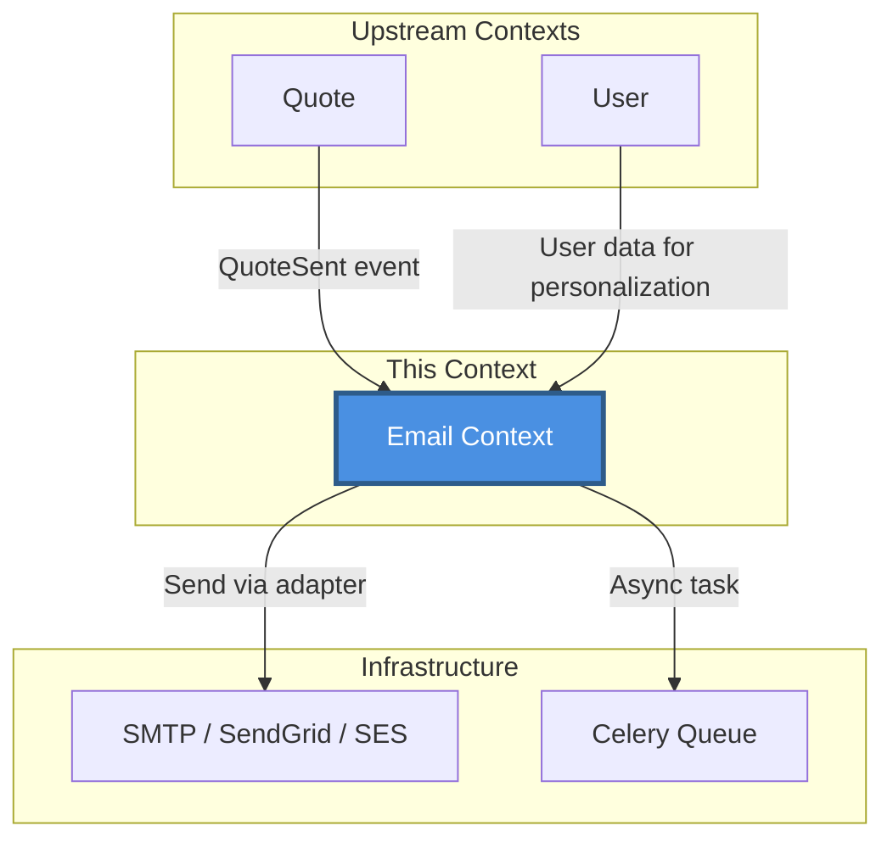
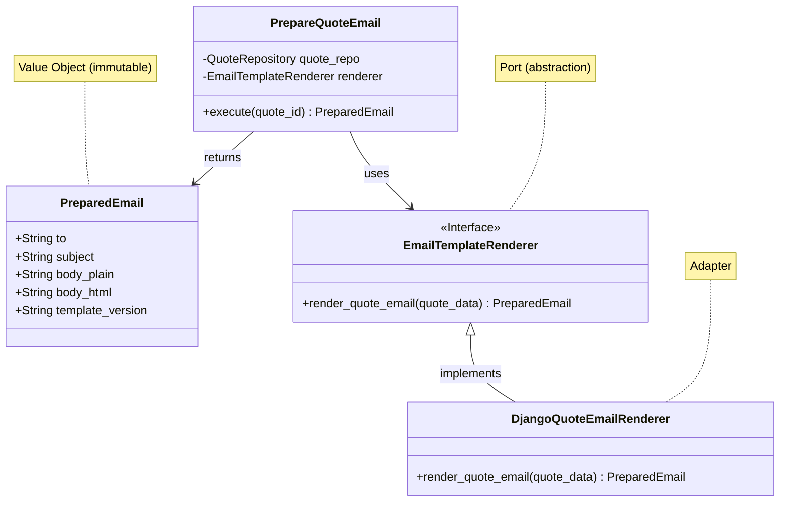

# Email Context

> 📋 Status: ✅ Stable
>
> 📅 **Dernière mise à jour**: 2025-11-25
>
> 👤 **Owner**: Bertrand Renaudin

---

## 🎯 Responsabilité

Ce contexte gère la préparation et l'envoi d'emails transactionnels : rendering de templates, préparation de contenu (plain text + HTML), et orchestration de l'envoi via SMTP ou service externe.

---

## 📖 Ubiquitous Language (Local)

| Terme | Définition | Type | Synonymes à éviter |
|-------|-----------|------|-------------------|
| **PreparedEmail** | Email entièrement rendu (subject, body_plain, body_html) prêt à être envoyé | Value Object | ≠ EmailDTO, EmailPayload |
| **EmailTemplateRenderer** | Port (interface) pour rendre templates email | Port (Interface) | - |
| **PrepareQuoteEmail** | Use case pour préparer email de devis (render template) | Use Case | - |
| **Template Version** | Version du template utilisé pour traçabilité | Value Object | - |

### Distinctions importantes

> 💡 Note: Email context ne gère QUE la préparation, l'envoi SMTP peut être délégué à un service externe

- **Prepared** ≠ Sent : Prepared = rendu prêt, Sent = transmis via SMTP
- **Template Rendering** : Domain responsibility (business data → email content)
- **SMTP Sending** : Infrastructure responsibility (adaptateur Celery/SES/SendGrid)

---

## 🏗️ Architecture

### Position dans le système



### Relations avec autres contextes

| Contexte | Type de relation | Description | Interface |
|----------|-----------------|-------------|-----------|
| **Quote** | ⬆️ Upstream | Consomme événement `QuoteSent` | Event handler |
| **User** | ⬆️ Upstream | Récupère données user pour personnalisation | User lookup |
| **Infrastructure (SMTP)** | ⬇️ Downstream | Délègue envoi effectif | Adapter SMTP/SES/SendGrid |

---

## 📦 Entités & Agrégats

### Vue d'ensemble



### Liste des entités

| Nom | Type | Description | Implémentation |
|-----|------|-------------|---------------|
| **PreparedEmail** | Value Object | Email rendu avec subject, body_plain, body_html | [domain/entities/prepared_email.py](file:///Users/bertrandrenaudin/Desktop/DEV/FreelanSign/backend/apps/email/domain/entities/prepared_email.py) |
| **EmailTemplateRenderer** | Port (Interface) | Abstraction pour rendering templates | [application/ports/email_template_renderer.py](file:///Users/bertrandrenaudin/Desktop/DEV/FreelanSign/backend/apps/email/application/ports) |
| **PrepareQuoteEmail** | Use Case | Prépare email devis pour envoi | [application/usecases/prepare_quote_email.py](file:///Users/bertrandrenaudin/Desktop/DEV/FreelanSign/backend/apps/email/application/usecases) |
| **DjangoQuoteEmailRenderer** | Adapter | Implémentation Django templates pour email quote | [adapters/rendering/django_quote_email_renderer.py](file:///Users/bertrandrenaudin/Desktop/DEV/FreelanSign/backend/apps/email/adapters/rendering) |

---

## 📋 Business Rules

### Règles critiques (P0)

| ID | Règle | Implémentation | Tests |
|----|-------|---------------|-------|
| BR-EMAIL-001 | Email doit avoir subject, body_plain, body_html | ✅ `PreparedEmail` dataclass validation | ✅ |
| BR-EMAIL-002 | Template version doit être tracée | ✅ `template_version` field | ⚠️ Tests TODO |

### Règles importantes (P1)

| ID | Règle | Implémentation | Tests |
|----|-------|---------------|-------|
| BR-EMAIL-011 | Fallback body_plain si rendering HTML échoue | ⚠️ TODO | ❌ |
| BR-EMAIL-012 | Retry logic si envoi SMTP échoue | ⚠️ Celery retry config | ⚠️ Partiellement |

---

## 🔄 Use Cases

### Vue d'ensemble

| Use Case | Actor | Trigger | Outcome |
|----------|-------|---------|---------|
| **Prepare Quote Email** | System | Quote sent event | PreparedEmail VO créé |
| **Send Email** | System | PreparedEmail → SMTP adapter | Email envoyé (async via Celery) |
| **Render Email Preview** | User | Preview button | PreparedEmail retourné (pas envoyé) |

### Détails par Use Case

#### 🔹 Prepare Quote Email

**Flow**:
1. Récupérer Quote par quote_id via repository
2. Construire quote_data DTO (title, client, total, pdf_url, etc.)
3. Appeler renderer.render_quote_email(quote_data)
4. Retourner PreparedEmail VO

**Règles appliquées**: BR-EMAIL-001, BR-EMAIL-002

**Implémentation**: `apps.email.application.usecases.prepare_quote_email.PrepareQuoteEmail`

**Tests**: `apps.email.tests.test_prepare_quote_email`

#### 🔹 Send Email (SMTP)

**Flow**:
1. Recevoir PreparedEmail
2. Créer message SMTP (to, subject, body_plain, body_html)
3. Envoyer via adapter (Django send_mail, SendGrid API, AWS SES)
4. Log succès/échec
5. Retry si échec (Celery)

**Implémentation**: Infrastructure adapter (hors scope domain)

---

## 🎛️ États & Transitions

Pas de machine à états (stateless rendering).

---

## 🔌 Interface / API

### REST API (Interface Layer)

| Endpoint | Method | Description | Auth |
|----------|--------|-------------|------|
| `/emails/quote/{quote_id}/preview/` | GET | Prévisualiser email sans envoyer | User (owner) |
| `/emails/quote/{quote_id}/send/` | POST | Préparer + envoyer email quote | User (owner) |

**Exemple requête (Preview)**:

```http
GET /api/emails/quote/{quote_id}/preview/
Authorization: Bearer {token}
```

**Exemple réponse**:

```json
{
  "to": "client@acme.com",
  "subject": "Votre devis DEV-2025-001 - FreelanSign",
  "body_plain": "Bonjour,\n\nVeuillez trouver ci-joint votre devis...",
  "body_html": "<html><body><h1>Votre devis</h1>...</body></html>",
  "template_version": "v1.2.0"
}
```

### Use Case Factory

```python
from apps.email import get_prepare_quote_email_uc

uc = get_prepare_quote_email_uc()
prepared_email = uc.execute(quote_id="uuid-here")
```

---

## 📨 Événements Domaine

### Événements émis

| Événement | Trigger | Payload | Consommateurs |
|-----------|---------|---------|---------------|
| `EmailSent` | Email envoyé avec succès | `{email_id, to, subject, sent_at}` | Analytics |
| `EmailFailed` | Échec envoi email | `{email_id, to, error}` | Monitoring, Retry |

### Événements consommés

| Événement | Source | Action |
|-----------|--------|--------|
| `QuoteSent` | Quote Context | Préparer + envoyer email quote au client |

---

## 📚 Ressources

### Documentation liée

- [[Quote Context]] - Source des données pour email quote
- [[User Context]] - Données freelance pour personnalisation

### Code

- **Backend**: [backend/apps/email/](file:///Users/bertrandrenaudin/Desktop/DEV/FreelanSign/backend/apps/email)
- **Domain**: [domain/](file:///Users/bertrandrenaudin/Desktop/DEV/FreelanSign/backend/apps/email/domain)
- **Application**: [application/](file:///Users/bertrandrenaudin/Desktop/DEV/FreelanSign/backend/apps/email/application)
- **Adapters**: [adapters/](file:///Users/bertrandrenaudin/Desktop/DEV/FreelanSign/backend/apps/email/adapters)
- **Templates**: [templates/](file:///Users/bertrandrenaudin/Desktop/DEV/FreelanSign/backend/apps/email/templates)
- **Tests**: [tests/](file:///Users/bertrandrenaudin/Desktop/DEV/FreelanSign/backend/apps/email/tests)

---

## 📝 Changelog

| Date | Version | Changement | Auteur |
|------|---------|-----------|--------|
| 2025-11-25 | 0.2.0 | Documentation initiale contexte Email | Bertrand Renaudin |

---

## 🔍 Gaps, Manques & Suggestions

> Section ajoutée pour identifier les améliorations potentielles

### Gaps identifiés

1. **Email queue management**: Pas de visibilité sur emails en queue/envoyés/échoués.

2. **Retry strategy**: Politique retry Celery non documentée (max attempts, backoff).

3. **Email templates versioning**: Comment gérer évolutions templates sans casser emails existants ?

4. **Attachments support**: PDF quote attaché, mais API générique attachments non visible.

5. **Email tracking**: Ouverture, clics liens non trackés (si requis par business).

6. **Bounce handling**: Gestion bounces (email invalide) non documentée.

### Manques documentation

1. **Template inheritance**: Structure templates Django (base.html, quote_email.html).

2. **Styling emails**: CSS inline pour compatibilité clients email.

3. **Localization**: Support multi-langue emails (fr/en).

4. **Testing templates**: Comment tester rendu visuel templates email ?

5. **Error handling**: Que se passe-t-il si rendering échoue (template syntax error) ?

### Suggestions

1. **Email types expansion**:
   - Welcome email (signup)
   - Password reset
   - Trial expiration reminder
   - Quote accepted notification
   - Payment confirmation

2. **Template marketplace**: Templates email pré-conçus pour différents use cases.

3. **A/B testing emails**: Tester plusieurs versions subject/body pour optimiser taux ouverture.

4. **Email preferences**: User peut désactiver certains types emails (notifications, marketing).

5. **Email logs/history**: Stocker tous emails envoyés pour audit (table EmailLog).

6. **Transactional vs Marketing**: Séparer contextes (Transactional Email, Marketing Email).

7. **DKIM/SPF/DMARC**: Configuration authentification email pour éviter spam.

8. **Unsubscribe link**: Lien désabonnement obligatoire (RGPD, CAN-SPAM).

9. **Email analytics dashboard**:
   - Taux ouverture
   - Taux clics
   - Bounces
   - Plaintes spam

10. **Multi-tenant templates**: Si SaaS multi-tenant, templates custom par compte.

11. **Scheduled emails**: Planifier envoi email à date/heure future.

12. **Email digests**: Regrouper plusieurs notifications en 1 email quotidien/hebdomadaire.

13. **Rich email editor**: UI WYSIWYG pour modifier templates sans toucher code.

14. **Email preview tools**: Litmus, Email on Acid pour tester rendu cross-clients.
