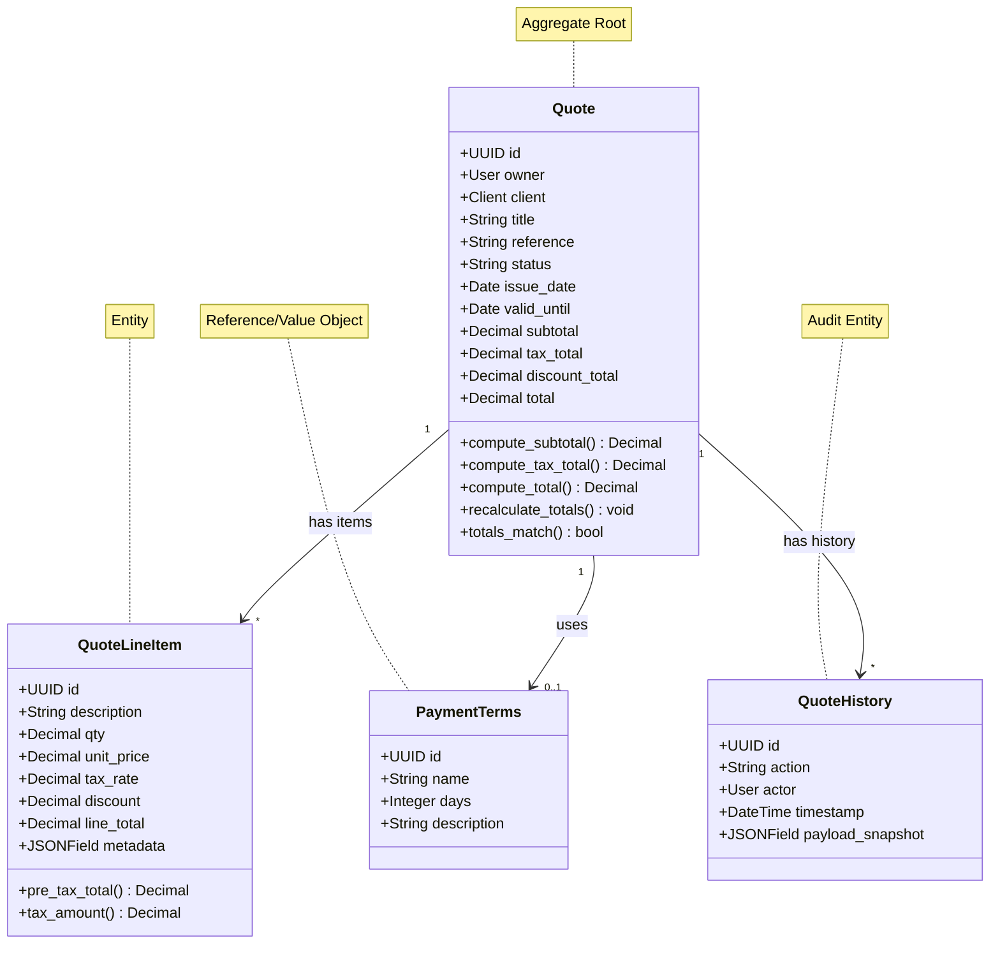
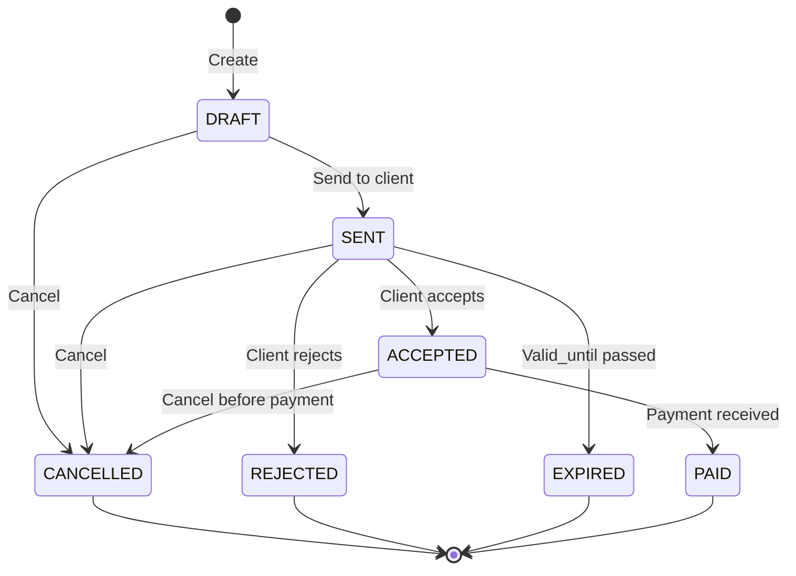

# Quote Context

> 📋 Status: ✅ Stable
>
> 📅 **Dernière mise à jour**: 2025-11-25
>
> 👤 **Owner**: Bertrand Renaudin

---

## 🎯 Responsabilité

Ce contexte gère la création, modification, calcul et gestion du cycle de vie des devis commerciaux (quotes) avec leurs lignes, conditions de paiement, calculs de totaux et historique.

---

## 📖 Ubiquitous Language (Local)

| Terme | Définition | Type | Synonymes à éviter |
|-------|-----------|------|-------------------|
| **Quote** | Devis commercial avec header (totaux) et lignes | Entity (Aggregate Root) | ≠ Invoice, Estimate |
| **QuoteLineItem** | Ligne de devis (description, quantité, prix unitaire) | Entity | ≠ Item, Line |
| **PaymentTerms** | Conditions de paiement (Net 30, Net 60, etc.) | Value Object/Reference | - |
| **QuoteHistory** | Événement d'audit pour traçabilité quote | Entity | - |
| **Status** | État du devis (DRAFT, SENT, ACCEPTED, REJECTED, PAID, CANCELLED, EXPIRED) | Value Object (Enum) | - |
| **Reference** | Identifiant human-readable unique par owner (ex: DEV-2025-001) | Value Object | ≠ ID |

### Distinctions importantes

> 💡 Note: Séparation header totals (Quote) vs line totals (QuoteLineItem) pour intégrité

- **Quote** ≠ Invoice : Quote = devis (avant vente), Invoice = facture (après vente)
- **Subtotal** = somme pre-tax lines, **Tax Total** = somme taxes, **Total** = subtotal + tax - discount
- **Reference** ≠ ID : Reference = human-readable (DEV-2025-001), ID = UUID technique
- **PaymentTerms** (template) ≠ payment_terms_text (free-text fallback)

---

## 🏗️ Architecture

### Position dans le système

```mermaid
graph TB
    subgraph "Upstream Contexts"
        U1[User]
        U2[Client]
        U3[Catalog]
    end

    subgraph "This Context"
        QC[Quote Context]
    end

    subgraph "Downstream Contexts"
        D1[Email]
        D2[Branding]
    end

    U1 -->|Owner (User FK)| QC
    U2 -->|Client FK| QC
    U3 -->|Prestation metadata| QC
    QC -->|QuoteCreated event| D1
    QC -->|Theme for PDF| D2

    style QC fill:#4A90E2,stroke:#2E5C8A,stroke-width:3px,color:#fff
```

### Relations avec autres contextes

| Contexte | Type de relation | Description | Interface |
|----------|-----------------|-------------|-----------|
| **User** | ⬆️ Upstream (ACL) | Quote appartient à un User owner | `owner: ForeignKey(User, PROTECT)` |
| **Client** | ⬆️ Upstream (ACL) | Quote associé à un Client | `client: ForeignKey(Client, PROTECT)` |
| **Catalog** | ⬆️ Upstream (ACL) | LineItem référence Prestation via metadata | JSON metadata |
| **Email** | ⬇️ Downstream | Envoie quote PDF par email | Event `QuoteSent` |
| **Branding** | ⬇️ Downstream | Applique thème pour génération PDF | Theme lookup |

---

## 📦 Entités & Agrégats

### Vue d'ensemble



### Liste des entités

| Nom | Type | Description | Implémentation |
|-----|------|-------------|---------------|
| **Quote** | Aggregate Root | Devis commercial avec header totaux | [models.py](file:///Users/bertrandrenaudin/Desktop/DEV/FreelanSign/backend/apps/quote/models.py#L58-L230) |
| **QuoteLineItem** | Entity | Ligne de devis avec qty, unit_price, tax_rate, discount | [models.py](file:///Users/bertrandrenaudin/Desktop/DEV/FreelanSign/backend/apps/quote/models.py#L232-L314) |
| **PaymentTerms** | Reference Data | Template conditions de paiement (Net 30, etc.) | [models.py](file:///Users/bertrandrenaudin/Desktop/DEV/FreelanSign/backend/apps/quote/models.py#L20-L55) |
| **QuoteHistory** | Audit Entity | Log événements quote (created, sent, status_changed) | [models.py](file:///Users/bertrandrenaudin/Desktop/DEV/FreelanSign/backend/apps/quote/models.py#L317-L353) |
| **Status** | Value Object (Enum) | DRAFT, SENT, ACCEPTED, REJECTED, PAID, CANCELLED, EXPIRED | [models.py](file:///Users/bertrandrenaudin/Desktop/DEV/FreelanSign/backend/apps/quote/models.py#L64-L71) |

---

## 📋 Business Rules

### Règles critiques (P0)

| ID | Règle | Implémentation | Tests |
|----|-------|---------------|-------|
| BR-QUOTE-001 | total = subtotal + tax_total - discount_total | ✅ `CheckConstraint(total=...)` | ✅ `test_totals_match` |
| BR-QUOTE-002 | Reference unique par owner | ✅ `UniqueConstraint(owner, reference)` | ✅ |
| BR-QUOTE-003 | Quote ne peut être supprimé, owner/client protected | ✅ `on_delete=PROTECT` | ✅ |
| BR-QUOTE-004 | LineItem tax_rate entre 0 et 100% | ✅ `validators=[MinValueValidator(0), MaxValueValidator(100)]` | ✅ |
| BR-QUOTE-005 | Recalcul totaux après modification lignes | ✅ `recalculate_totals()` | ✅ |

### Règles importantes (P1)

| ID | Règle | Implémentation | Tests |
|----|-------|---------------|-------|
| BR-QUOTE-011 | Status SENT enregistre sent_at | ✅ Logic application layer | ✅ |
| BR-QUOTE-012 | Status ACCEPTED enregistre accepted_at | ✅ Logic application layer | ✅ |
| BR-QUOTE-013 | PaymentTerms ou payment_terms_text (fallback) | ✅ FK nullable + TextField | ⚠️ Validation TODO |
| BR-QUOTE-014 | Metadata LineItem stocke référence catalog | ✅ `metadata: JSONField` | ⚠️ Schema TODO |

### Règles secondaires (P2)

| ID | Règle | Implémentation | Tests |
|----|-------|---------------|-------|
| BR-QUOTE-021 | QuoteHistory log tous changements critiques | ✅ Signals/application layer | ⚠️ Coverage partielle |

---

## 🔄 Use Cases

### Vue d'ensemble

| Use Case | Actor | Trigger | Outcome |
|----------|-------|---------|---------|
| **Create Quote** | User | Formulaire nouveau devis | Quote DRAFT créé |
| **Add Line Item** | User | Ajout ligne | LineItem créé, totaux recalculés |
| **Remove Line Item** | User | Supprimer ligne | LineItem supprimé, totaux recalculés |
| **Send Quote** | User | Envoyer par email | Status → SENT, sent_at set, PDF généré, email envoyé |
| **Accept Quote** | Client | Acceptation signature | Status → ACCEPTED, accepted_at set |
| **Reject Quote** | Client | Refus signature | Status → REJECTED |
| **Cancel Quote** | User | Annulation | Status → CANCELLED |
| **Mark as Paid** | User | Paiement reçu | Status → PAID |
| **Generate PDF** | System | Quote finalisé | PDF stocké dans pdf_file |

### Détails par Use Case

#### 🔹 Create Quote

**Flow**:
1. Valider owner et client existent
2. Générer reference unique (ex: DEV-2025-001)
3. Créer Quote avec status=DRAFT, totaux=0
4. Créer QuoteHistory entry (action=CREATED)
5. Retourner Quote DTO

**Règles appliquées**: BR-QUOTE-002, BR-QUOTE-003

**Implémentation**: `apps.quote.application.use_cases.create_quote`

#### 🔹 Add Line Item

**Flow**:
1. Valider quote existe et appartient à owner
2. Valider qty, unit_price >= 0
3. Créer QuoteLineItem avec métadonnées catalog
4. Appeler `quote.recalculate_totals()`
5. Retourner LineItem DTO

**Règles appliquées**: BR-QUOTE-001, BR-QUOTE-004, BR-QUOTE-005

#### 🔹 Send Quote

**Flow**:
1. Valider status == DRAFT
2. Générer PDF avec branding theme
3. Stocker PDF dans `quote.pdf_file`
4. Mettre à jour status → SENT, sent_at = now()
5. Émettre événement `QuoteSent`
6. Email context envoie PDF au client

**Règles appliquées**: BR-QUOTE-011

---

## 🎛️ États & Transitions

### Diagramme d'états



### Matrice états → actions autorisées

| État | Modifier lignes | Envoyer | Accepter | Rejeter | Marquer payé | Annuler |
|------|----------------|---------|----------|---------|--------------|---------|
| **DRAFT** | ✅ | ✅ | ❌ | ❌ | ❌ | ✅ |
| **SENT** | ❌ | ❌ | ✅ | ✅ | ❌ | ✅ |
| **ACCEPTED** | ❌ | ❌ | ❌ | ❌ | ✅ | ✅ |
| **REJECTED** | ❌ | ❌ | ❌ | ❌ | ❌ | ❌ |
| **PAID** | ❌ | ❌ | ❌ | ❌ | ❌ | ❌ |
| **CANCELLED** | ❌ | ❌ | ❌ | ❌ | ❌ | ❌ |
| **EXPIRED** | ❌ | ❌ | ❌ | ❌ | ❌ | ❌ |

---

## 🔌 Interface / API

### REST API (Interface Layer)

| Endpoint | Method | Description | Auth |
|----------|--------|-------------|------|
| `/quotes/` | GET | Liste quotes de l'owner | User |
| `/quotes/` | POST | Créer quote | User |
| `/quotes/{id}/` | GET | Détail quote | User (owner only) |
| `/quotes/{id}/` | PATCH | Modifier quote header | User (owner only) |
| `/quotes/{id}/items/` | POST | Ajouter ligne | User |
| `/quotes/{id}/items/{item_id}/` | DELETE | Supprimer ligne | User |
| `/quotes/{id}/send/` | POST | Envoyer par email | User |
| `/quotes/{id}/pdf/` | GET | Télécharger PDF | User |

**Exemple requête (Create Quote)**:

```json
POST /api/quotes/
Authorization: Bearer {token}
Content-Type: application/json

{
  "client_id": "uuid-client",
  "title": "Développement site web",
  "issue_date": "2025-11-25",
  "valid_until": "2025-12-25",
  "payment_terms_id": "uuid-net30",
  "currency": "EUR",
  "language": "fr"
}
```

**Exemple réponse**:

```json
{
  "id": "uuid-quote",
  "reference": "DEV-2025-001",
  "title": "Développement site web",
  "status": "DRAFT",
  "owner": {"id": "uuid-owner", "email": "john@example.com"},
  "client": {"id": "uuid-client", "name": "ACME Corp"},
  "issue_date": "2025-11-25",
  "valid_until": "2025-12-25",
  "currency": "EUR",
  "subtotal": "0.00",
  "tax_total": "0.00",
  "discount_total": "0.00",
  "total": "0.00",
  "items": [],
  "created_at": "2025-11-25T10:00:00Z"
}
```

---

## 📨 Événements Domaine

### Événements émis

| Événement | Trigger | Payload | Consommateurs |
|-----------|---------|---------|---------------|
| `QuoteCreated` | Create quote | `{quote_id, owner_id, client_id}` | Analytics, QuoteHistory |
| `QuoteSent` | Send quote | `{quote_id, pdf_url, client_email}` | Email context |
| `QuoteAccepted` | Accept quote | `{quote_id, accepted_at}` | Analytics, Email |
| `QuoteRejected` | Reject quote | `{quote_id}` | Analytics |
| `QuotePaid` | Mark as paid | `{quote_id, total}` | Analytics |
| `LineItemAdded` | Add line | `{quote_id, item_id}` | Recalculate totals |
| `LineItemRemoved` | Remove line | `{quote_id, item_id}` | Recalculate totals |

### Événements consommés

Aucun.

---

## 📚 Ressources

### Code

- **Backend**: [backend/apps/quote/](file:///Users/bertrandrenaudin/Desktop/DEV/FreelanSign/backend/apps/quote)
- **Models**: [models.py](file:///Users/bertrandrenaudin/Desktop/DEV/FreelanSign/backend/apps/quote/models.py)
- **Domain**: [domain/](file:///Users/bertrandrenaudin/Desktop/DEV/FreelanSign/backend/apps/quote/domain)
- **Application**: [application/](file:///Users/bertrandrenaudin/Desktop/DEV/FreelanSign/backend/apps/quote/application)
- **Tests**: [tests/](file:///Users/bertrandrenaudin/Desktop/DEV/FreelanSign/backend/apps/quote/tests)

---

## 📝 Changelog

| Date | Version | Changement | Auteur |
|------|---------|-----------|--------|
| 2025-11-25 | 0.2.0 | Documentation initiale contexte Quote | Bertrand Renaudin |

---

## 🔍 Gaps, Manques & Suggestions

> Section ajoutée pour identifier les améliorations potentielles

### Gaps identifiés

1. **Reference auto-generation**: Logic de génération reference (DEV-2025-001) non visible dans models.py. Implémenter dans use case ou signal.

2. **Validation payment_terms XOR payment_terms_text**: Pas de contrainte garantissant qu'au moins un des deux est rempli.

3. **LineItem metadata schema**: Pas de validation JSONSchema pour metadata catalog. Risque inconsistance.

4. **Quote.clean() not called**: Django admin pourrait bypass `clean()`, utiliser contraintes DB.

5. **PDF generation failure handling**: Que se passe-t-il si génération PDF échoue lors de Send ?

### Manques documentation

1. **Domain services**: `TotalsCalculator`, `TaxPolicy`, `StatusPolicy` existent mais non détaillés.

2. **PDF generation**: Adapter Playwright utilisé ? Template engine ?

3. **Email sending**: Workflow exact non documenté (lien avec Email context).

4. **Quote expiration**: Process automatique marcage EXPIRED si `valid_until` passé ?

5. **Quote versioning**: Pas de système de versions si quote modifié après envoi.

### Suggestions

1. **Value Objects**: `Money` (amount + currency), `Reference`, `TaxRate`, `Quantity` comme VO typés.

2. **Quote duplication**: Use case "Duplicate Quote" pour réutiliser template.

3. **Quote templates**: Système de templates de devis pour accélérer création.

4. **Multi-currency**: Support devise étrangère, taux de change.

5. **Partial payments**: Supporter paiements partiels (acompte 30%, solde 70%).

6. **Quote approval workflow**: Pour grandes structures, workflow validation interne avant envoi.

7. **E-signature integration**: Intégrer DocuSign/HelloSign pour acceptation numérique.

8. **Quote comparison**: Comparer plusieurs versions d'un devis.

9. **Automated reminders**: Relances automatiques si pas de réponse client après X jours.

10. **Analytics**: Taux de conversion quotes (SENT → ACCEPTED), délai moyen réponse.
