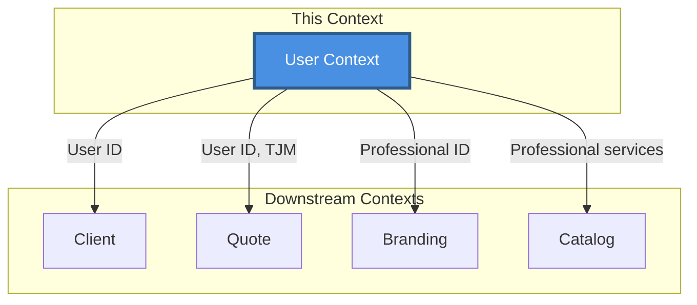
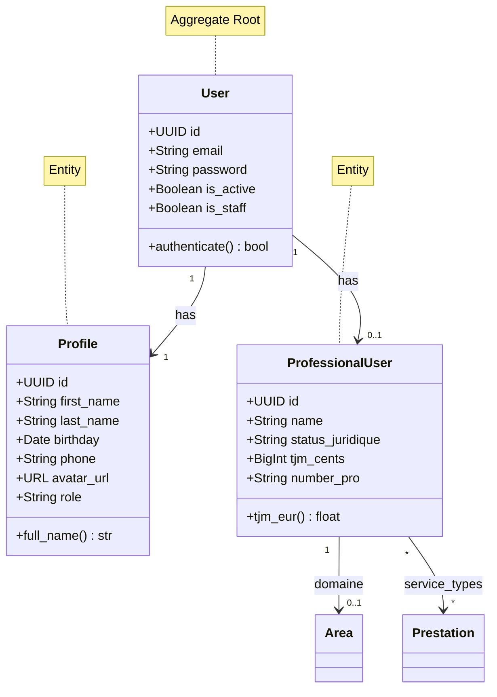
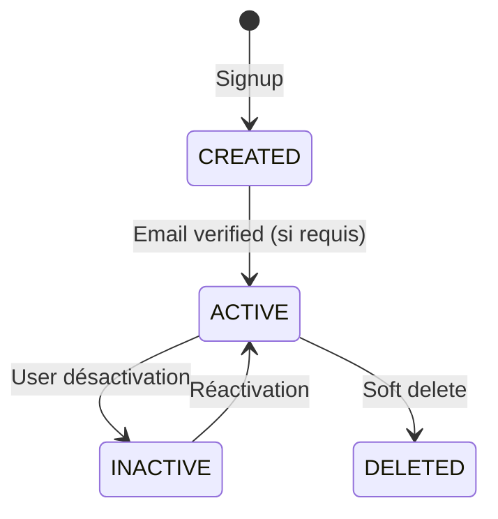

# User Context

> 📋 Status: ✅ Stable
>
> 📅 **Dernière mise à jour**: 2025-11-25
>
> 👤 **Owner**: Bertrand Renaudin

---

## 🎯 Responsabilité

Ce contexte gère l'authentification, les profils utilisateurs, et les informations professionnelles des freelances.

---

## 📖 Ubiquitous Language (Local)

| Terme | Définition | Type | Synonymes à éviter |
|-------|-----------|------|-------------------|
| **User** | Compte utilisateur avec email/password pour authentification Django | Entity (Aggregate Root) | - |
| **Profile** | Informations personnelles de l'utilisateur (nom, prénom, avatar, rôle) | Entity | - |
| **ProfessionalUser** | Informations professionnelles du freelance (SIRET, TJM, domaine d'activité) | Entity | ≠ Profile |
| **StatusJuridique** | Statut juridique du professionnel (micro, EIRL, EURL, SASU) | Value Object | - |

### Distinctions importantes

> 💡 Note: Séparation claire entre User (auth), Profile (info perso), et ProfessionalUser (info pro)

- **User** ≠ Profile : User = auth Django, Profile = données métier personnelles
- **Profile** ≠ ProfessionalUser : Profile = info perso, ProfessionalUser = info business/facturation
- **Role** : Défini dans Profile (freelance/admin), pas dans User

---

## 🏗️ Architecture

### Position dans le système



### Relations avec autres contextes

| Contexte | Type de relation | Description | Interface |
|----------|-----------------|-------------|-----------|
| **Client** | ⬇️ Downstream | Fournit owner pour clients | User FK |
| **Quote** | ⬇️ Downstream | Fournit owner pour devis | User FK |
| **Branding** | ⬇️ Downstream | Fournit professional pour thèmes | User FK |
| **Catalog** | 🤝 Partner | Lien bidirectionnel Area/Prestation | ForeignKey/M2M |

---

## 📦 Entités & Agrégats

### Vue d'ensemble



### Liste des entités

| Nom | Type | Description | Implémentation |
|-----|------|-------------|---------------|
| **User** | Aggregate Root | Compte authentification Django (AbstractUser) | [models.py](file:///Users/bertrandrenaudin/Desktop/DEV/FreelanSign/backend/apps/user/models/models.py#L54-L71) |
| **Profile** | Entity | Données personnelles utilisateur | [models.py](file:///Users/bertrandrenaudin/Desktop/DEV/FreelanSign/backend/apps/user/models/models.py#L73-L99) |
| **ProfessionalUser** | Entity | Données professionnelles freelance | [models.py](file:///Users/bertrandrenaudin/Desktop/DEV/FreelanSign/backend/apps/user/models/models.py#L102-L131) |
| **StatusJuridique** | Value Object (Enum) | Statut juridique (micro, EIRL, EURL, SASU, other) | [models.py](file:///Users/bertrandrenaudin/Desktop/DEV/FreelanSign/backend/apps/user/models/models.py#L13-L18) |

---

## 📋 Business Rules

### Règles critiques (P0)

| ID | Règle | Implémentation | Tests |
|----|-------|---------------|-------|
| BR-USER-001 | Email doit être unique (case-insensitive) | ✅ `UniqueConstraint(Lower("email"))` | ✅ |
| BR-USER-002 | Un User peut avoir 0 ou 1 Profile (OneToOne) | ✅ `OneToOneField` | ✅ |
| BR-USER-003 | Un User peut avoir 0 ou 1 ProfessionalUser (OneToOne) | ✅ `OneToOneField` | ✅ |
| BR-USER-004 | Email est le USERNAME_FIELD pour auth | ✅ `USERNAME_FIELD = "email"` | ✅ |

### Règles importantes (P1)

| ID | Règle | Implémentation | Tests |
|----|-------|---------------|-------|
| BR-USER-011 | TJM stocké en centimes (éviter erreurs float) | ✅ `tjm_cents: BigIntegerField` | ✅ |
| BR-USER-012 | Full_name deprecated, utiliser Profile first/last_name | ⚠️ Champ legacy présent | ❌ Migration TODO |

---

## 🔄 Use Cases

### Vue d'ensemble

| Use Case | Actor | Trigger | Outcome |
|----------|-------|---------|---------|
| **Register User** | Anonymous | Signup form | User + Profile créés |
| **Login** | User | Login form | JWT token émis |
| **Update Profile** | User | Profile edit | Profile.updated_at modifié |
| **Setup Professional Info** | User | Onboarding pro | ProfessionalUser créé |
| **Calculate TJM** | System | Quote creation | TJM utilisé comme unit_price par défaut |

### Détails par Use Case

#### 🔹 Register User

**Flow**:
1. Valider email unique (case-insensitive)
2. Créer User avec password hashé
3. Créer Profile vide associé (via signal)
4. Retourner User + tokens

**Règles appliquées**: BR-USER-001, BR-USER-002, BR-USER-004

**Implémentation**: `apps.user.application.*`

---

## 🎛️ États & Transitions

### Diagramme d'états (User)



---

## 🔌 Interface / API

### REST API (Interface Layer)

| Endpoint | Method | Description | Auth |
|----------|--------|-------------|------|
| `/auth/register/` | POST | Créer compte utilisateur | Anonymous |
| `/auth/login/` | POST | Authentification email/password | Anonymous |
| `/users/me/` | GET | Récupérer infos utilisateur courant | User |
| `/users/me/profile/` | GET/PATCH | Gérer profile perso | User |
| `/users/me/professional/` | GET/PATCH | Gérer infos professionnelles | User |

**Exemple requête**:

```json
POST /api/auth/register/
Content-Type: application/json

{
  "email": "john@example.com",
  "password": "SecurePass123!",
  "first_name": "John",
  "last_name": "Doe"
}
```

**Exemple réponse**:

```json
{
  "user": {
    "id": "uuid-here",
    "email": "john@example.com",
    "profile": {
      "first_name": "John",
      "last_name": "Doe",
      "avatar_url": null,
      "role": "freelance"
    }
  },
  "tokens": {
    "access": "jwt-access-token",
    "refresh": "jwt-refresh-token"
  }
}
```

---

## 📨 Événements Domaine

### Événements émis

| Événement | Trigger | Payload | Consommateurs |
|-----------|---------|---------|---------------|
| `UserCreated` | Signup | `{user_id, email}` | Email, Analytics |
| `ProfileUpdated` | Profile edit | `{user_id, profile_data}` | Analytics |
| `ProfessionalInfoAdded` | Pro setup | `{user_id, tjm_cents, domaine}` | Quote, Analytics |

### Événements consommés

Aucun événement externe consommé (contexte upstream).

---

## 📚 Ressources

### Code

- **Backend**: [backend/apps/user/](file:///Users/bertrandrenaudin/Desktop/DEV/FreelanSign/backend/apps/user)
- **Models**: [models/models.py](file:///Users/bertrandrenaudin/Desktop/DEV/FreelanSign/backend/apps/user/models/models.py)
- **Domain**: [domain/](file:///Users/bertrandrenaudin/Desktop/DEV/FreelanSign/backend/apps/user/domain)
- **Application**: [application/](file:///Users/bertrandrenaudin/Desktop/DEV/FreelanSign/backend/apps/user/application)
- **Tests**: [tests/](file:///Users/bertrandrenaudin/Desktop/DEV/FreelanSign/backend/apps/user/tests)

---

## 📝 Changelog

| Date | Version | Changement | Auteur |
|------|---------|-----------|--------|
| 2025-11-25 | 0.2.0 | Documentation initiale contexte User | Bertrand Renaudin |

---

## 🔍 Gaps, Manques & Suggestions

> Section ajoutée pour identifier les améliorations potentielles

### Gaps identifiés

1. **Migration full_name → Profile**: Le champ `User.full_name` est deprecated mais toujours présent. Migrer données vers `Profile.first_name/last_name` et supprimer.

2. **Email verification**: Pas de workflow de vérification email visible. Considérer ajout pour sécurité.

3. **Password reset**: Flow de reset password non documenté ici.

4. **Soft delete**: Pas de mécanisme de soft delete sur User (contrairement à Prestation). Considérer pour RGPD.

### Manques documentation

1. **Domain services**: `UserCalculator` et `UserPolicy` existent mais non détaillés ici.

2. **Application layer**: DTOs et use cases non exhaustivement listés.

3. **Règles métier TJM**: Comment le TJM est-il utilisé concrètement ? Lien avec Quote à clarifier.

### Suggestions

1. **Séparer Profile/Professional en 2 agrégats** : Profile pourrait être un agrégat indépendant pour réduire couplage.

2. **Value Objects** : `Email`, `Phone`, `TJM` pourraient être des VO typés avec validation.

3. **Role enum** : Actuellement dans `Profile.Role`, pourrait être un enum global Core si utilisé ailleurs.

4. **Avatar storage** : Utiliser FileField au lieu de URLField pour upload direct ?

5. **Tests E2E** : Ajouter tests d'intégration signup → profile setup → professional info.
