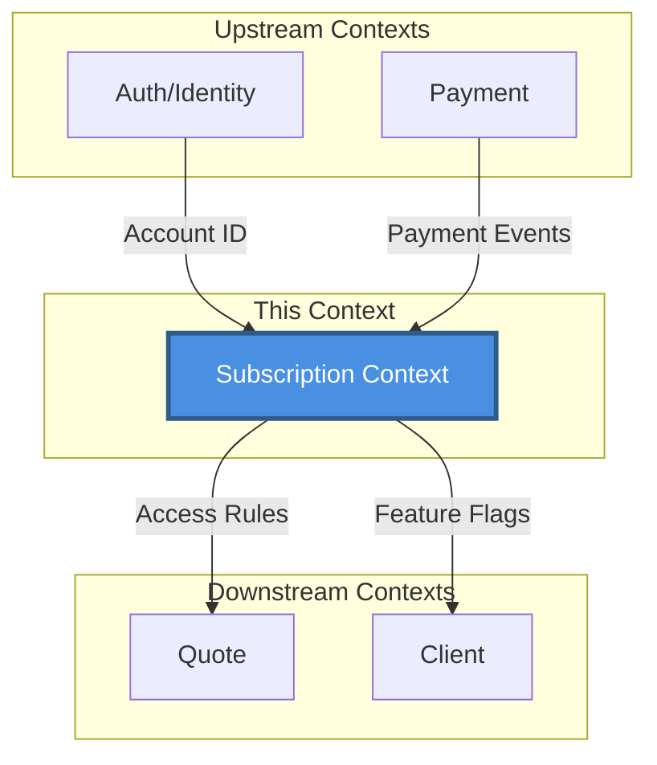
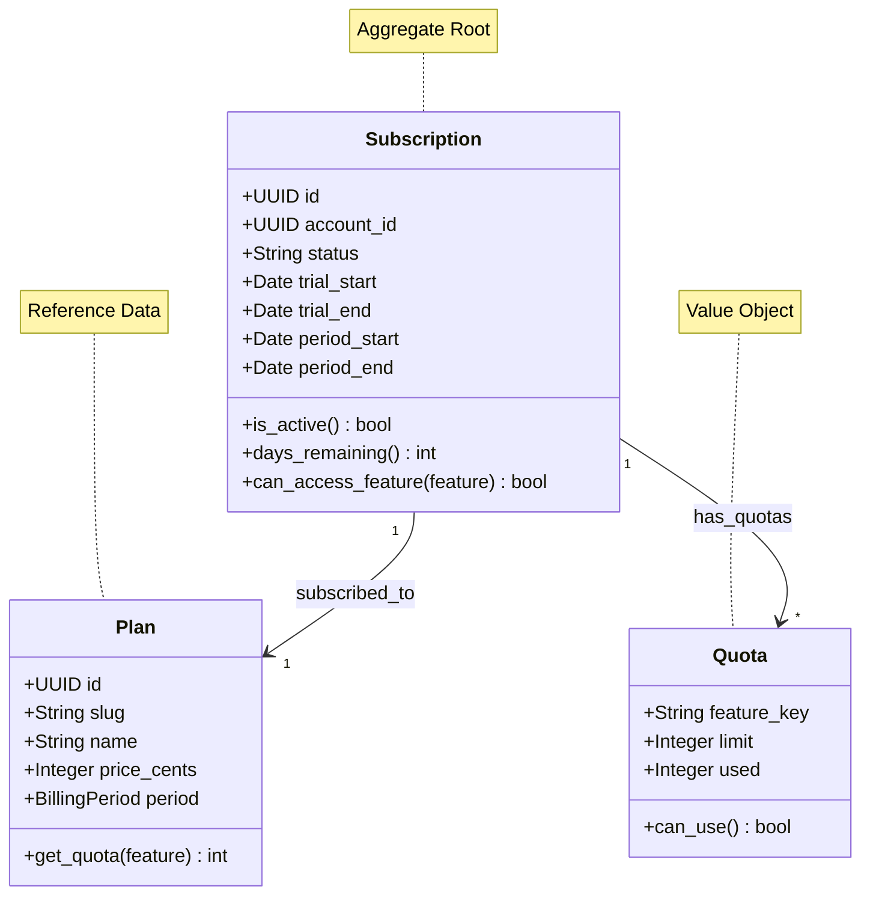
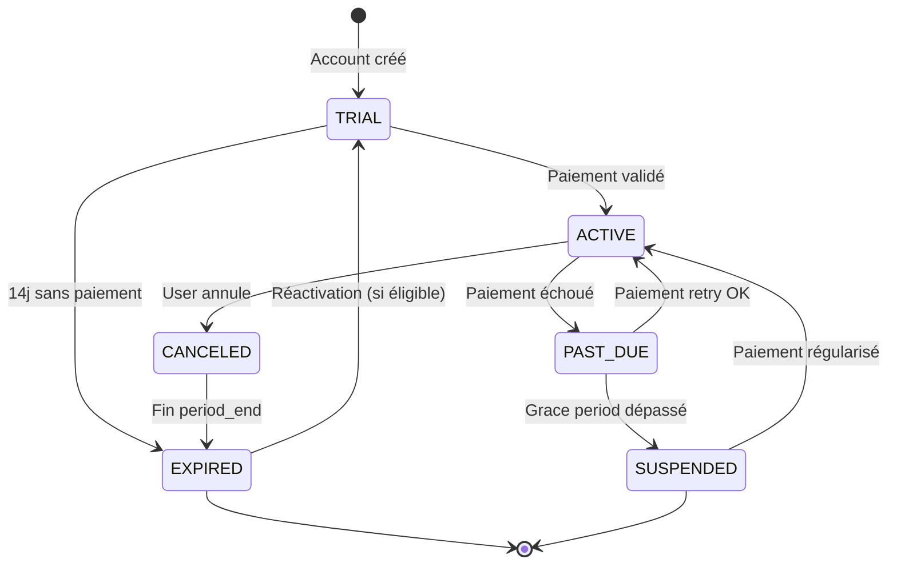

# [Nom du Contexte] Context

> 📋 Status: 🚧 Draft | ✅ Stable | 🔄 Refactoring | ⚠️ Legacy
>
>
> 📅 **Dernière mise à jour**: [Date]
>
> 👤 **Owner**: [Nom]
>

---

## 🎯 Responsabilité

> Une phrase claire et concise décrivant la responsabilité unique de ce contexte.
>

**Exemple**: Ce contexte gère les abonnements, essais gratuits, plans tarifaires et limites d'usage des comptes professionnels.

---

## 📖 Ubiquitous Language (Local)

| Terme | Définition | Type | Synonymes à éviter |
| --- | --- | --- | --- |
| **[Terme1]** | Description précise du concept dans CE contexte | Entity / VO / Service | ≠ autre terme |
| **[Terme2]** | ... | Aggregate Root | - |
| **[Terme3]** | ... | Value Object | - |

### Distinctions importantes

> 💡 Note: Clarifications sur des termes qui pourraient prêter à confusion
>

**Exemple**:

- **Subscription** ≠ Plan : Subscription = instance d'abonnement d'un Account, Plan = offre tarifaire catalogue
- **Trial** ≠ Free Plan : Trial = période temporaire, Free Plan = offre permanente gratuite

---

## 🏗️ Architecture

### Position dans le système

Exemple :



### Relations avec autres contextes

Exemple :

| Contexte | Type de relation | Description | Interface |
| --- | --- | --- | --- |
| **Auth/Identity** | ⬆️ Upstream (ACL) | Consomme User/Account ID | `GET /accounts/{id}` |
| **Payment** | ⬆️ Upstream (Partner) | Reçoit événements paiement | Webhooks Stripe |
| **Quote** | ⬇️ Downstream | Fournit règles d'accès | `can_create_quote(account_id)` |
| **Client** | ⬇️ Downstream | Fournit limites | `get_quota(account_id)` |

**Légende**:

- ⬆️ **Upstream**: Ce contexte dépend d'eux
- ⬇️ **Downstream**: Ils dépendent de ce contexte
- 🤝 **Partner**: Collaboration mutuelle
- **ACL**: Anti-Corruption Layer (traduction)
- **Shared Kernel**: Code partagé

---

## 📦 Entités & Agrégats

### Vue d'ensemble

Exemple:



### Liste des entités

Exemple:

| Nom | Type | Description | Lien détaillé |
| --- | --- | --- | --- |
| **Subscription** | Aggregate Root | Instance d'abonnement d'un Account | [[Entity: Subscription]] |
| **Plan** | Entity (Reference) | Catalogue d'offres tarifaires | [[Entity: Plan]] |
| **Quota** | Value Object | Limite d'usage pour une feature | [[Entity: Quota]] |
| **BillingCycle** | Value Object | Période de facturation en cours | - |

---

## 📋 Business Rules

### Règles critiques (P0)

Exemple:

| ID | Règle | Implémentation | Tests |
| --- | --- | --- | --- |
| BR-[CTX]-001 | Un Account ne peut avoir qu'un seul Subscription actif | ✅ `Subscription.activate()` | ✅ `test_single_active_subscription` |
| BR-[CTX]-002 | Trial expire automatiquement après 14 jours sans paiement | ✅ `TrialPolicy.is_expired()` | ✅ `test_trial_expiration` |
| BR-[CTX]-003 | Changement de Plan prend effet immédiatement | ❌ TODO | ❌ |

### Règles importantes (P1)

Exemple:

| ID | Règle | Implémentation | Tests |
| --- | --- | --- | --- |
| BR-[CTX]-011 | Downgrade possible uniquement en fin de période | ❌ TODO | ❌ |
| BR-[CTX]-012 | Annulation = accès maintenu jusqu'à period_end | ✅ `Subscription.cancel()` | ✅ |

### Règles secondaires (P2)

Exemple:

| ID | Règle | Implémentation | Tests |
| --- | --- | --- | --- |
| BR-[CTX]-021 | Notification 3 jours avant expiration trial | ❌ TODO | ❌ |

---

## 🔄 Use Cases

### Vue d'ensemble

Exemple:

| Use Case | Actor | Trigger | Outcome |
| --- | --- | --- | --- |
| **Start Trial** | User | Création Account | Trial actif 14j |
| **Subscribe to Plan** | User | Paiement validé | Subscription active |
| **Check Quota** | System | Création devis | Autorisé/Refusé |
| **Cancel Subscription** | User | Action utilisateur | Canceled, actif jusqu'à period_end |
| **Handle Payment Failed** | System | Webhook Stripe | Grace period ou suspension |

### Détails par Use Case

Exemple:

### 🔹 Start Trial

**Flow**:

1. Vérifier Account existe (via Auth context)
2. Vérifier aucun Subscription actif
3. Créer Subscription avec status=TRIAL
4. Calculer trial_end = now + 14 jours
5. Initialiser quotas selon Free Trial plan
6. Émettre événement `TrialStarted`

**Règles appliquées**: BR-[CTX]-001, BR-[CTX]-002

**Tests**: `test_start_trial_success`, `test_prevent_duplicate_trial`

**Lien**: [[UC: Start Trial]]

---

## 🎛️ États & Transitions

### Diagramme d'états

Exemple:



### Matrice états → actions autorisées

Exemple:

| État | Créer devis | Voir clients | Modifier profil | Payer |
| --- | --- | --- | --- | --- |
| **TRIAL** | ✅ (limité) | ✅ (limité) | ✅ | ✅ |
| **ACTIVE** | ✅ (selon plan) | ✅ | ✅ | ✅ (upgrade) |
| **PAST_DUE** | ⚠️ (grace 7j) | ✅ | ✅ | ✅ (requis) |
| **CANCELED** | ✅ (jusqu'à period_end) | ✅ | ✅ | ❌ |
| **EXPIRED** | ❌ | ❌ (read-only) | ✅ | ✅ (réactivation) |
| **SUSPENDED** | ❌ | ❌ | ✅ | ✅ (régularisation) |

---

## 📊 Quotas & Limites

Exemple:

### Par Plan

| Feature | Free Trial | Starter | Pro | Enterprise |
| --- | --- | --- | --- | --- |
| **Prix** | 0€ | 19€/mois | 49€/mois | Custom |
| **Durée** | 14 jours | ∞ | ∞ | ∞ |
| **Devis/mois** | 5 | 20 | ∞ | ∞ |
| **Clients** | 3 | 50 | ∞ | ∞ |
| **Branding custom** | ❌ | ❌ | ✅ | ✅ |
| **Export PDF avancé** | ❌ | ❌ | ✅ | ✅ |
| **API Access** | ❌ | ❌ | ❌ | ✅ |
| **Support** | Email | Email | Priority | Dedicated |

### Feature Flags

| Flag | Description | Plans activés |
| --- | --- | --- |
| `custom_branding` | Logo/couleurs personnalisées | Pro, Enterprise |
| `pdf_advanced` | Templates PDF avancés | Pro, Enterprise |
| `api_access` | Accès API REST | Enterprise |
| `white_label` | Retrait branding FreelanSign | Enterprise |

---

## 🔌 Interface / API

Exemple:

### REST API (Interface Layer)

| Endpoint | Method | Description | Auth |
| --- | --- | --- | --- |
| `/subscriptions/trial` | POST | Démarrer essai gratuit | User |
| `/subscriptions/current` | GET | Récupérer subscription actuelle | User |
| `/subscriptions/upgrade` | POST | Changer de plan | User |
| `/subscriptions/cancel` | POST | Annuler abonnement | User |
| `/subscriptions/quotas` | GET | Voir quotas actuels | User |

**Exemple requête**:

```
POST /api/subscriptions/trial
Authorization: Bearer {token}
Content-Type: application/json

{
  "account_id": "uuid-here"
}

```

**Exemple réponse**:

```json
{
  "id": "sub_xxx",
  "status": "trial",
  "trial_ends_at": "2025-12-09T00:00:00Z",
  "plan": {
    "slug": "free_trial",
    "name": "Essai Gratuit"
  },
  "quotas": {
    "quotes_per_month": {
      "limit": 5,
      "used": 0,
      "remaining": 5
    }
  }
}

```

---

## 📨 Événements Domaine

### Événements émis

Exemple:

| Événement | Trigger | Payload | Consommateurs |
| --- | --- | --- | --- |
| `TrialStarted` | Création trial | `{account_id, trial_ends_at}` | Email, Analytics |
| `TrialExpired` | Trial terminé sans conversion | `{account_id}` | Email, Onboarding |
| `SubscriptionActivated` | Paiement OK | `{account_id, plan_slug}` | Email, Analytics |
| `SubscriptionCanceled` | User annule | `{account_id, expires_at}` | Email, Analytics |
| `QuotaExceeded` | Limite atteinte | `{account_id, feature, limit}` | UI, Email |

### Événements consommés

| Événement | Source | Action |
| --- | --- | --- |
| `PaymentSucceeded` | Payment Context | Activer subscription |
| `PaymentFailed` | Payment Context | Marquer PAST_DUE |
| `AccountCreated` | Auth Context | Créer trial auto (si activé) |

---

## ❓ Questions Ouvertes

> 💡 Décisions à prendre ou clarifications nécessaires
>

Exemple:

| Question | Priority | Status | Décision | Date |
| --- | --- | --- | --- | --- |
| Durée trial: 7j, 14j ou 30j? | P0 | ✅ Décidé | 14 jours | 2025-11-20 |
| CB requise pour trial? | P1 | 🚧 En discussion | Non (friction) | - |
| Grace period après paiement échoué? | P1 | ❌ Ouvert | À décider | - |
| Proration lors changement plan? | P2 | ❌ Ouvert | - | - |
| Gestion multi-currency? | P2 | ❌ Ouvert | V2 | - |

---

## 📚 Ressources

### Documentation liée

Exemple:

- [[Entity: Subscription]] - Détails entité Subscription
- [[Entity: Plan]] - Catalogue plans
- [[UC: Start Trial]] - Use case détaillé
- [[Product: Pricing Strategy]] - Stratégie tarifaire globale

### Références externes

Exemple:

- [Stripe Subscriptions Best Practices](https://stripe.com/docs/billing/subscriptions/overview)
- [SaaS Metrics Guide](https://example.com/)

### Code

Exemple:

- **Backend**: `backend/apps/subscription/`
- **Frontend**: `frontend/src/domains/subscription/`
- **Tests**: `backend/apps/subscription/tests/`

---

## 📝 Changelog

Exemple:

| Date | Version | Changement | Auteur |
| --- | --- | --- | --- |
| 2025-11-25 | 0.1.0 | Création contexte initial | [Nom] |
| - | - | - | - |

---
