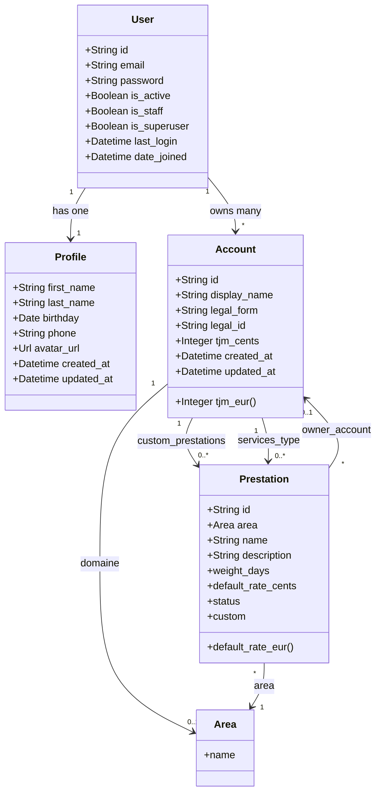

# Entité

## User

<aside>
💡

Ubiquitous Langage : `User` = “compte d’auth” dans FreelanSign, pas “freelance”.

</aside>

| Field Name | Type | Description | Relation |
| --- | --- | --- | --- |
| id | String | id du user |  |
| email | String | email du user (nécessaire pour se connecter) - identifiant |  |
| password | String | mot de passe du user  |  |
| is_active | Boolean | (gérer par django) |  |
| is_staff | Boolean | (gérer par django) |  |
| is_superuser | Boolean | (gérer par django) |  |
| last_login | DateTime | (gérer par django) |  |
| date_joined | DateTime | (gérer par django) |  |
| Relations | — | — | — |
| profile | Profile | profile utilisateur | one to one |
| account | Account | compte professionnel | one to many |

## Profile

<aside>
💡

Ubiquitous Langage : `Profile` sert à afficher l’identité humaine (nom, avatar, etc.), pas à contrôler des droits.

</aside>

| Field Name | Type | Description | relation |
| --- | --- | --- | --- |
| id | String | id du profile |  |
| first_name | String | prénom de l’utilisateur |  |
| last_name | String | nom de l’utilisateur |  |
| birthday | Date | date de naissance de l’utilisateur |  |
| phone | String | numéro de téléphone |  |
| avatar_url | Url | url de l’avatar |  |
| created_at | DateTime | date de création |  |
| update_at | DateTime | Date de modification |  |
| Relations | — | — | — |
| user | User | `user` = compte d’authentification associé à ce profil. | one to one |

## ~~Professional User~~ Account

<aside>
💡

Ubiquitous Langage : `Account`  Représente le **compte professionnel** d’un freelance sur FreelanSign.

C’est l’entité qui :

- possède les clients, devis, prestations custom, branding,
- est liée à un abonnement (subscription) chez FreelanSign,
- correspond à une entité juridique (micro, EURL, etc.).
</aside>

Nouveau nom : Account

| Field Name | Type | Description | relation |
| --- | --- | --- | --- |
| id | String | id du professional user |  |
| display_name | String | nom professionnel |  |
| legal_form | LegalForm | Forme juridique : MICRO, EURL, SASU, OTHER… |  |
| tjm_cent | Integer | taux journalier de l’utilisateur |  |
| legal_id | String | Identifiant légal principal (ex : SIRET ou autre) |  |
| created_at | DateTime | date de création |  |
| update_at | DateTime | Date de modification |  |
| Relations | — | — | — |
| user | User | utilisateur | one to one |
| services_types | Prestation | prestations de l’utilisateur | many to many |
| domaine | Area | domaine d’activité | many to one (plusieurs Account pour une Area, optionnel) |

# Diagram Class

### After

