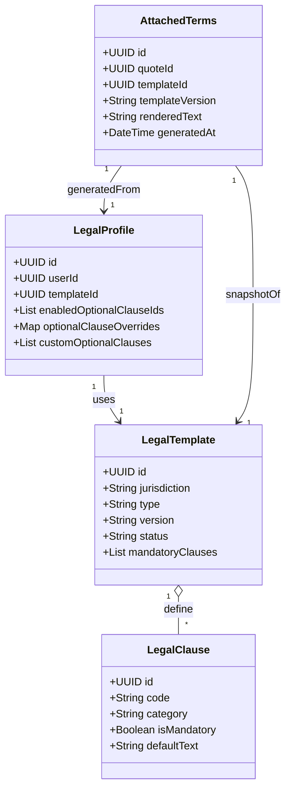
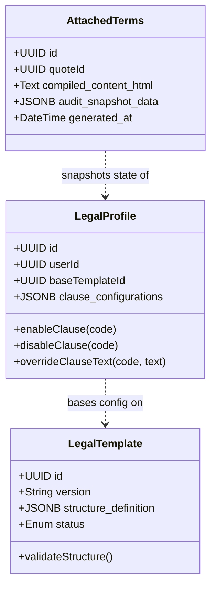

<aside>
💡

# Context Overview

</aside>

## Rôle du contexte

Le bounded context **LegalTerms** gère tout ce qui concerne les **termes juridiques embarqués dans les devis** émis par les utilisateurs (auto-entrepreneurs) vers leurs clients.

Objectif principal :

- Garantir que **chaque devis généré** via FreelanSign contient une **section juridique complète** (CGV/CGU + mentions obligatoires), basée sur un modèle français, avec possibilité de personnalisation contrôlée.

Ce contexte ne concerne **pas** les CGU/CGV de FreelanSign en tant que SaaS (relation FreelanSign ↔ utilisateur).

---

## Responsabilités

- Fournir un **modèle de base** de CGV/CGU conforme au cadre général français pour un auto-entrepreneur.
- Gérer un **profil juridique** par utilisateur (LegalProfile) basé sur :
    - un template de base,
    - des clauses obligatoires non modifiables,
    - des clauses optionnelles activables/désactivables et personnalisables.
- Générer une **version figée** des CGV/CGU à attacher à chaque devis généré.
- Exposer des use cases du type :
    - Prévisualiser les termes juridiques associés à un utilisateur.
    - Mettre à jour le profil juridique (activation/désactivation de clauses optionnelles, modification de leur texte).
    - Attacher une version figée des termes juridiques à un devis donné.

---

## Hors scope

- CGU / Mentions légales du SaaS FreelanSign (relation FreelanSign ↔ utilisateur).
- Génération de contrats complets indépendants du devis (contrats de prestation, NDA, etc.).
- Gestion de juridictions autres que la France.
- Support multilingue (uniquement français pour l’instant).

---

## Invariants métier

- Chaque devis émis via FreelanSign **doit contenir** un bloc de CGV/CGU (aucun devis sans section juridique).
- Les **clauses obligatoires** ne sont **pas modifiables** par l’utilisateur :
    - leur contenu textuel est piloté par FreelanSign (template global).
- Les **clauses optionnelles** peuvent :
    - être activées/désactivées par l’utilisateur,
    - être éditées dans certaines limites (contenu textuel).
- Le bloc juridique est **distinct** de la mise en forme graphique du devis :
    - la charte / branding ne s’applique pas à la structure de base des termes,
    - mais peut influencer des éléments mineurs (typo, couleurs simples) si nécessaire.

---

## Décisions de conception

- Juridiction unique : **France** (`jurisdiction = "FR"`).
- Un **template principal** pour les auto-entrepreneurs, avec :
    - un jeu de clauses obligatoires (non éditables),
    - un catalogue de clauses optionnelles (capacité future à en ajouter d’autres).
- Le profil juridique de l’utilisateur (`LegalProfile`) est dérivé du template principal + des variables issues du **BC Account** (nom, SIRET, adresse, etc.).
- Un système de **versioning** des termes juridiques est nécessaire :
    - chaque évolution importante du template global doit incrémenter une version,
    - chaque devis doit référencer la **version** utilisée au moment de sa génération.

> **Le Versioning (Réponse au TODO) :**
>
> - **Approche recommandée :** Le "Full Snapshot" (Copie intégrale).
> - **Pourquoi ?** Le stockage ne coûte rien, les avocats coûtent cher. Ne tente pas de reconstruire un document légal d'il y a 2 ans en recombinant `Template v1.2` + `Clause A v3` + `Variable X`. C'est trop fragile.
> - **Solution :** L'entité `AttachedTerms` doit contenir le **texte final rendu (HTML ou Markdown)**. Les références (ID du template, version) ne sont là que pour l'audit, pas pour la reconstruction.

> **Format de stockage :**
>
> - Utilise du **JSONB** (si tu es sur PostgreSQL) pour stocker la structure des clauses dans `LegalProfile` et `LegalTemplate`. Cela te donnera la flexibilité nécessaire sans multiplier les tables de jointure inutiles.

---

## Interactions avec les autres BC

- **Auth/Identity / Account**
    - Fournit les données d’identification de l’auto-entrepreneur (nom, SIRET, adresse, email…).
    - Ces données sont injectées dans les variables du profil juridique.
- **Quote**
    - Consomme une version figée des termes juridiques lors de la génération du devis.
    - Stocke un lien vers la version de `AttachedTerms` associée au devis.
- **Branding**
    - Peut influencer la mise en forme globale du PDF,
    - Mais ne doit pas remettre en cause la structure textuelle des clauses obligatoires.
- **Email**
    - Peut inclure un rappel ou un lien vers les termes juridiques associés au devis,
    - Mais ne modifie aucun contenu légal.

---

## Entités & Agrégats (brouillon)

- `LegalTemplate`
    - id
    - jurisdiction = "FR"
    - type = "CGV+CGU"
    - version
    - status (active / deprecated)
    - base_structure (structure hiérarchique des sections)
    - mandatory_clauses[] (références vers LegalClause)
- `LegalClause`
    - id
    - category (paiement, IP, résiliation, etc.)
    - is_mandatory (bool)
    - default_text
    - code (identifiant fonctionnel : "LATE_PAYMENT", "IP_OWNERSHIP"...)
- `LegalProfile` (par utilisateur)
    - id
    - user_id
    - template_id (référence vers LegalTemplate actif)
    - enabled_optional_clauses_ids[]
    - custom_optional_clauses[] (ajoutées par l’utilisateur)
    - overrides (éventuels textes personnalisés sur les clauses optionnelles)
- `AttachedTerms`
    - id
    - quote_id
    - template_id
    - template_version
    - clauses_snapshot (liste des clauses effectivement appliquées)
    - rendered_text (bloc texte figé, tel qu’il apparaît dans le PDF)
    - generated_at

---

## Diagramme d’ensemble (mermaid)

<aside>
💡

# Ubiquitous Language

</aside>

| Terme | Définition métier | Notes / Synonymes |
| --- | --- | --- |
| CGV | Conditions Générales de Vente attachées aux devis émis par l'utilisateur vers ses clients. | Partie des Legal Terms. |
| CGU | Conditions Générales d'Utilisation du service du freelance, côté client final. | Partie des Legal Terms. |
| Legal Terms | Bloc juridique complet (CGV + CGU + mentions obligatoires) attaché à un devis. | Terme générique. |
| LegalTemplate | Modèle de base de Legal Terms défini par FreelanSign pour une juridiction donnée (FR). | Un seul template FR au début. |
| LegalClause | Clause individuelle (paiement, IP, résiliation, etc.), obligatoire ou optionnelle. | Identifiée par un code. |
| Mandatory Clause | Clause marquée comme obligatoire, non modifiable par l'utilisateur. | Contrôlée par FreelanSign. |
| Optional Clause | Clause optionnelle que l'utilisateur peut activer/désactiver et personnaliser. |  |
| LegalProfile | Configuration juridique propre à un utilisateur (template + clauses actives + personnalisations). |  |
| AttachedTerms | Version figée des Legal Terms attachée à un devis donné. | Snapshot immuable. |
| Jurisdiction | Contexte légal ciblé (FR dans la V1). | Pas d'autres pays pour l’instant. |

---

<aside>
💡

### Entites & Aggregates

</aside>

**1. Aggregate: LegalTemplate (Reference Data)**

C'est la bibliothèque de clauses gérée par FreelanSign.

- `id` (UUID)
- `version` (String - ex: "2024.1")
- `status` (Enum: DRAFT, ACTIVE, ARCHIVED)
- `structure` (JSONB): Contient la liste ordonnée des clauses par défaut.
    - *Exemple de structure JSON :* `[{ code: "PAYMENT", type: "MANDATORY", content: "...", order: 1 }]`

**2. Aggregate: LegalProfile (User Configuration)**

La configuration vivante de l'utilisateur.

- `id` (UUID)
- `user_id` (UUID - Partition Key)
- `base_template_id` (UUID - pointe vers le template actif)
- `configurations` (JSONB):
    - Stocke les `overrides` de texte.
    - Stocke l'état `enabled/disabled` des clauses optionnelles.
    - Stocke les `custom_clauses` (clauses ajoutées manuellement par l'user).
- `updated_at` (Timestamp)

**3. Aggregate: AttachedTerms (Immutable Snapshot)**

Le document légal scellé.

- `id` (UUID)
- `quote_id` (UUID - Foreign Key vers BC Quote)
- `source_profile_id` (UUID)
- `snapshot_version` (String - ex: "v1" pour ce devis spécifique)
- `compiled_content` (Text/Blob): **Le contenu HTML/Markdown final généré.** C'est la "vérité".
- `structured_snapshot` (JSONB): Une copie de la configuration au moment T (pour analyse future si besoin).
- `generated_at` (Timestamp)

---

<aside>
💡

## Diagram

</aside>

---

<aside>
💡

### Use Cases

</aside>

Voici les scénarios fonctionnels clés pour tes tests d'acceptation.

**UC-01 : Initialiser le profil juridique (Onboarding)**

- **Acteur :** Système (lors de la création de compte).
- **Flux :**
    1. Récupérer le `LegalTemplate` actif (FR).
    2. Créer un `LegalProfile` par défaut pour l'utilisateur.
    3. Activer toutes les clauses recommandées par défaut.

**UC-02 : Personnaliser ses conditions (Settings)**

- **Acteur :** Utilisateur.
- **Flux :**
    1. L'utilisateur consulte la liste des clauses disponibles.
    2. Il désactive une clause optionnelle (ex: "Acompte").
    3. Il modifie le texte d'une clause optionnelle (ex: "Délai de paiement" passe de 30 à 15 jours).
    4. Le système valide que les clauses obligatoires sont intactes.
    5. Le système sauvegarde le `LegalProfile`.

**UC-03 : Générer et Attacher les termes au devis (Quote Generation)**

- **Acteur :** Système (déclenché par BC Quote).
- **Input :** `QuoteContext` (Montant, Client, UserID, etc.).
- **Flux :**
    1. Charger le `LegalProfile` de l'utilisateur.
    2. Injecter les variables du `QuoteContext` (Nom client, Date, Montant) dans les templates de texte ("Merge tags").
    3. Compiler le texte final complet.
    4. Créer une entité `AttachedTerms` persistée.
    5. Retourner l'ID du `AttachedTerms` au BC Quote.

**UC-04 : Mise à jour légale majeure (Maintenance)**

- **Acteur :** Admin FreelanSign.
- **Flux :**
    1. FreelanSign publie un nouveau `LegalTemplate` (loi changée).
    2. Un batch job notifie les utilisateurs.
    3. Lors de la prochaine connexion/édition, le `LegalProfile` de l'utilisateur est migré vers le nouveau template (avec conservation de ses personnalisations si compatibles).

---

<aside>
💡

### API / Interface

</aside>

On distingue l'API publique (pour le frontend) de l'API interne (entre modules/BC).

**1. API Publique (REST - Utilisée par le Frontend)**

- `GET /api/legal/profile`
    - *Retourne :* La configuration actuelle de l'utilisateur, la liste des clauses, leur état (actif/inactif) et le texte éditable.
- `PATCH /api/legal/profile/clauses/{clauseCode}`
    - *Body :* `{ "is_enabled": boolean, "custom_text": string }`
    - *Action :* Met à jour une clause spécifique.
- `GET /api/legal/preview`
    - *Action :* Génère un rendu PDF/HTML à la volée basé sur le profil actuel (pour prévisualisation sans sauvegarde).

**2. Interface de Module (Interne - Utilisée par le Backend Quote)**

- `Function: attachTermsToQuote(quoteId: UUID, contextData: Map<String, String>) -> UUID`
    - Cette fonction est le point d'entrée principal pour le module Quote.
    - Elle orchestre la récupération du profil, le "templating" (remplacement des variables), la création du snapshot `AttachedTerms`, et retourne l'ID à lier au devis.
- `Function: getRenderedTerms(attachedTermsId: UUID) -> String`
    - Récupère le contenu HTML figé pour la génération du PDF final du devis.

---
