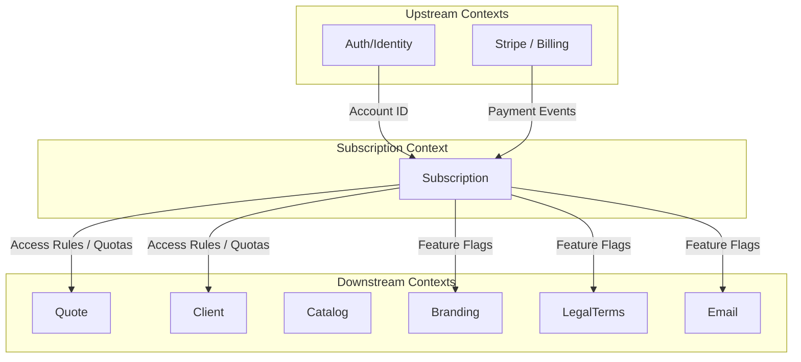
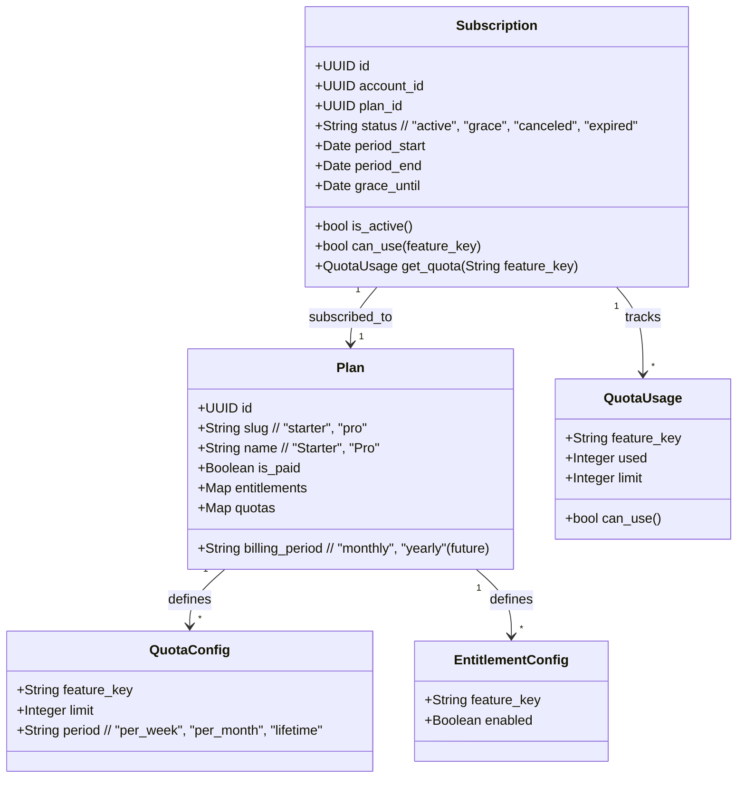
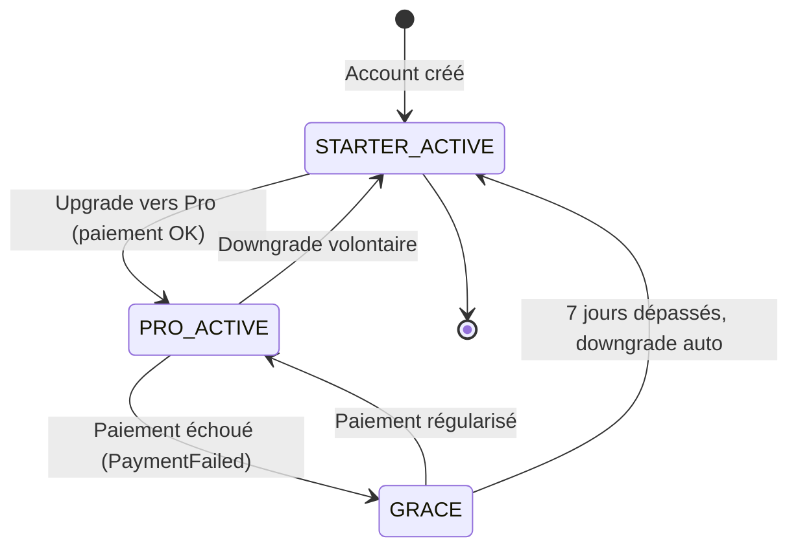

> 📋 Status: 🚧 Draft
>
>
> 📅 **Dernière mise à jour**: 2025-11-25
>
> 👤 **Owner**: @Bertrand2808
>

---

## 🎯 Responsabilité

> Le contexte Subscription gère les plans tarifaires (Starter / Pro), l’état d’abonnement d’un compte, les quotas d’usage (devis, clients, features), et les règles d’accès aux fonctionnalités en fonction du plan.
>

---

<aside>
💡

## 📖 Ubiquitous Language (Local)

</aside>

| Terme | Définition | Type | Synonymes à éviter |
| --- | --- | --- | --- |
| **Plan** | Offre tarifaire catalogue (ex: `starter`, `pro`) avec un ensemble d’entitlements/quotas. | Entity (Reference Data) | `Subscription`, `Formule` |
| **Subscription** | Instance d’abonnement pour un `Account`, liée à un `Plan` (ex: un compte est abonné au plan Pro). | Aggregate Root | `Plan` |
| **Entitlement** | Droit d’accès à une fonctionnalité (ex: custom branding, LegalTerms avancé). | Value Object / Config | `Feature`, `Permission` |
| **Quota** | Limite numérique pour une feature (ex: nb de devis / semaine, nb de clients max). | Value Object | - |
| **Starter Plan** | Plan gratuit, permanent, avec quotas stricts et fonctionnalités limitées. | Plan | `Free Trial`, `Demo` |
| **Pro Plan** | Plan payant, avec devis illimités, clients étendus, LegalTerms avancés, branding avancé. | Plan | `Premium`, `Expert` |
| **Account** | Compte utilisateur FreelanSign (lié au BC Auth/Identity). | External Entity | `User` dans ce contexte |
| **Feature Flag** | Indicateur booléen permettant d’activer/désactiver une fonctionnalité selon le plan. | Value Object | - |

### Distinctions importantes

> 💡 Notes
>
- **Subscription ≠ Plan**
    - *Plan* = “ce qui existe au catalogue” (Starter, Pro).
    - *Subscription* = “ce que cet account a vraiment en ce moment” (ex: abonné au Pro jusqu’au 31/12).
- **Starter (free) ≠ Trial**
    - Starter = **plan gratuit permanent** avec limites.
    - Trial = période temporaire d’essai d’un plan payant (pas modélisé en V1).
- **Entitlement ≠ Quota**
    - Entitlement = “tu as le droit à cette feature”.
    - Quota = “jusqu’à X fois / Y items”.

---

<aside>
💡

## 🏗️ Architecture

</aside>

### Position dans le système



### Relations avec autres contextes

| Contexte | Type de relation | Description | Interface (idée) |
| --- | --- | --- | --- |
| **Auth/Identity** | ⬆️ Upstream (ACL) | Fournit `Account` (id, statut, infos de base). | `GET /accounts/{id}` |
| **Payment** | ⬆️ Upstream (Partner / futur) | Remonte les événements de paiement (succès, échec). | Webhooks / Events |
| **Quote** | ⬇️ Downstream | Vérifie quotas et droits avant création / édition de devis. | `can_create_quote(account_id)` |
| **Client** | ⬇️ Downstream | Vérifie limites sur nb de clients. | `can_add_client(account_id)` |
| **Branding** | ⬇️ Downstream | Vérifie accès au branding avancé. | `has_feature(account_id, "branding_advanced")` |
| **LegalTerms** | ⬇️ Downstream | Vérifie accès aux clauses optionnelles/custom. | `has_feature(account_id, "legal_terms_advanced")` |
| **Email** | ⬇️ Downstream | Vérifie droit d’envoyer des emails et quotas liés. | `can_send_quote_email(account_id)` |

---

<aside>
💡

## 📦 Entités & Agrégats

</aside>

### Vue d'ensemble



### Liste des entités

| Nom | Type | Description | Lien détaillé |
| --- | --- | --- | --- |
| **Subscription** | Aggregate Root | État d’abonnement d’un `Account` (plan, période, status, usage). | [[Entity: Subscription]] |
| **Plan** | Entity (Reference Data) | Offre tarifaire catalogue (Starter, Pro) avec entitlements/quotas. | [[Entity: Plan]] |
| **QuotaConfig** | Value Object | Limite théorique d’une feature pour un plan donné. | [[VO: QuotaConfig]] |
| **QuotaUsage** | Value Object | Usage courant d’un quota (utilisé vs limite). | [[VO: QuotaUsage]] |
| **EntitlementConfig** | Value Object | Activation booléenne d’une feature pour un plan. | [[VO: EntitlementConfig]] |

---

<aside>
💡

## 📋 Business Rules

</aside>

### Règles critiques (P0 – MVP)

| ID | Règle | Implémentation (prévue) | Tests |
| --- | --- | --- | --- |
| BR-SUB-001 | Un `Account` ne peut avoir qu’une seule `Subscription` active. | `SubscriptionRepository.enforce_single_active(account_id)` | ✅ à écrire |
| BR-SUB-002 | Un nouveau compte est automatiquement associé au plan **Starter**. | `OnAccountCreated -> create_starter_subscription()` | ✅ |
| BR-SUB-003 | Le plan Starter impose des quotas stricts (ex: nb max de clients, nb max de devis / période). | `Subscription.can_use("create_quote")` / quotas | ✅ |
| BR-SUB-004 | Le plan Pro donne accès aux devis illimités et aux features avancées (branding, LegalTerms avancés, etc.). | `has_feature` / quotas illimités | ✅ |
| BR-SUB-005 | Un downgrade Pro → Starter conserve l’historique (devis, clients) mais rend certaines actions read-only si les quotas Starter sont dépassés. | `Subscription.downgrade_to("starter")` | ✅ |
| BR-SUB-006 | En cas de non-paiement, l’account passe en `grace` pendant 7 jours, puis bascule en plan Starter. | `handle_payment_failed(account_id)` | ✅ |
| BR-SUB-007 | Même en plan Starter, l’utilisateur doit pouvoir télécharger ses devis existants. | `can_download_quote` toujours autorisé si `account_owns_quote`. | ✅ |
| BR-SUB-008 | L’accès aux LegalTerms avancés (clauses optionnelles/custom) est réservé au plan Pro. | `has_feature(account_id, "legal_terms_advanced")` | ✅ |

### Règles importantes (P1 – V2)

| ID | Règle | Implémentation (prévue) | Tests |
| --- | --- | --- | --- |
| BR-SUB-011 | Mise en place d’un trial Pro limité (durée à définir), distinct du plan Starter. | `status = "trial_pro"` | ❌ |
| BR-SUB-012 | Limites sur nb d’emails de devis envoyés par mois. | `quota["emails_per_month"]` | ❌ |
| BR-SUB-013 | Vérification anti-abus basique (comptes multiples avec même SIRET). | `AntiAbuseService.check_duplicate_siret()` | ❌ |

### Règles secondaires (P2)

| ID | Règle | Implémentation (prévue) | Tests |
| --- | --- | --- | --- |
| BR-SUB-021 | Facturation annuelle en plus de mensuelle. | `Plan.billing_period` | ❌ |
| BR-SUB-022 | Proration lors de changement de plan. | Payment context | ❌ |

---

<aside>
💡

## 🔄 Use Cases

</aside>

### Vue d'ensemble

| Use Case | Actor | Trigger | Outcome |
| --- | --- | --- | --- |
| **View Current Plan** | User | Ouvre page “Plan & Usage” | Voit son plan, ses quotas, options Pro. |
| **Upgrade to Pro** | User | Clic “Passer en Pro” + paiement OK | `Subscription` passe sur plan Pro, features débloquées immédiatement. |
| **Downgrade to Starter** | User | Clic “Revenir au plan Starter” | `Subscription` repasse en Starter, features Pro verrouillées, données préservées. |
| **Check Quota: Create Quote** | System | User tente de créer un devis | Si quota OK → autorisé, sinon → erreur + incitation upgrade. |
| **Handle Payment Failed** | System | Webhook paiement échoué | Status → `grace` (7 jours), puis retour en Starter. |

### Détail : `Check Quota: Create Quote`

**Flow (MVP)** :

1. `Quote` appelle `Subscription.can_use("create_quote")` pour l’`account_id`.
2. `Subscription` récupère le quota config du plan + usage courant.
3. Si plan = Pro → **illimité** → autorisé.
4. Si plan = Starter → vérifier limite (ex: X devis par semaine).
    - Si `used < limit` → autorisé, `used++`.
    - Sinon → refus, retour d’un code `QUOTA_EXCEEDED` (front peut afficher “Passez en Pro”).
5. Si downgrade récent : anciens devis restent accessibles, mais création bloquée si quota déjà dépassé.

**Règles appliquées**: BR-SUB-003, BR-SUB-004, BR-SUB-005.

---

<aside>
💡

## 🎛️ États & Transitions

</aside>

### Diagramme d'états (simplifié V1)



### Matrice états → actions autorisées (MVP)

| État | Créer devis | Créer client | Modifier Branding avancé | LegalTerms avancés | Télécharger devis |
| --- | --- | --- | --- | --- | --- |
| **STARTER_ACTIVE** | ✅ (limité par quotas) | ✅ (limité – ex: 5 clients) | ❌ (branding basique only) | ❌ (template de base uniquement) | ✅ |
| **PRO_ACTIVE** | ✅ (illimité) | ✅ (sans limite sensible) | ✅ | ✅ (clauses optionnelles + custom) | ✅ |
| **GRACE** | ✅ (comportement Pro, mais warnings UI) | ✅ | ✅ | ✅ | ✅ |

---

## 📊 Quotas & Limites (proposés)

> ⚠️ À challenger / affiner. On ne grave pas encore les chiffres.
>

### Par Plan (idée)

| Feature | Starter (Free) | Pro (Paid) |
| --- | --- | --- |
| **Prix** | 0€ / mois | (TBD – ex: 10–25€/mois) |
| **Devis** | Limite stricte (ex: 3 / semaine ou X / mois) | Illimité |
| **Clients** | Limite stricte (ex: 5 clients max) | Illimité (ou très haut) |
| **Branding basique (logo + couleurs)** | ✅ | ✅ |
| **Branding avancé (thèmes, plus de contrôle)** | ❌ | ✅ |
| **Watermark FreelanSign** | ✅ (imposé) | ❌ |
| **LegalTerms de base (clauses obligatoires)** | ✅ | ✅ |
| **LegalTerms avancés (clauses optionnelles + custom)** | ❌ | ✅ |
| **Email envoi de devis** | ❌ (MVP) | ✅ (limite / mois en P1) |
| **Mini-CRM (vues avancées client)** | ❌ (P1/V2) | ✅ (P1/V2) |

### Feature Flags (exemples)

| Flag | Description | Plans activés |
| --- | --- | --- |
| `branding_advanced` | Accès aux contrôles de branding avancés. | Pro |
| `legal_terms_advanced` | Clauses optionnelles + custom dans LegalTerms. | Pro |
| `quote_unlimited` | Devis illimités. | Pro |
| `client_unlimited` | Clients illimités. | Pro |
| `remove_watermark` | Retirer “Made with FreelanSign”. | Pro |

---

## 🔌 Interface / API

*(à adapter à la stack actuel, ici c’est une intention)*

### REST API (backend)

| Endpoint | Method | Description | Auth |
| --- | --- | --- | --- |
| `/subscriptions/current` | GET | Récupérer la subscription courante pour l’account. | User |
| `/subscriptions/upgrade` | POST | Upgrade vers Pro (après paiement). | User |
| `/subscriptions/downgrade` | POST | Downgrade vers Starter. | User |
| `/subscriptions/check-quota` | POST | Vérifier un quota pour une feature donnée. | Internal (services) |

**Exemple réponse `GET /subscriptions/current`**

```json
{
  "account_id": "acc_xxx",
  "plan": {
    "slug": "starter",
    "name": "Starter",
    "is_paid": false
  },
  "status": "active",
  "quotas": {
    "quotes_per_week": {
      "limit": 3,
      "used": 1,
      "remaining": 2
    },
    "clients_total": {
      "limit": 5,
      "used": 2,
      "remaining": 3
    }
  },
  "features": {
    "branding_advanced": false,
    "legal_terms_advanced": false
  }
}

```

---

## 📨 Événements Domaine

### Événements émis

| Événement | Trigger | Payload | Consommateurs |
| --- | --- | --- | --- |
| `SubscriptionCreated` | Création Starter pour nouvel account | `{account_id, plan_slug}` | Analytics, Email |
| `SubscriptionUpgraded` | Passage Starter → Pro | `{account_id, old_plan, new_plan}` | Email, Analytics |
| `SubscriptionDowngraded` | Pro → Starter (manuel ou automatique) | `{account_id, old_plan, new_plan, reason}` | Email, Analytics |
| `SubscriptionGraceStarted` | Paiement échoué → début période de grâce | `{account_id, grace_until}` | UI / Email |
| `QuotaExceeded` | Tentative d’action alors que quota dépassé | `{account_id, feature_key, limit}` | UI, Email (option) |

### Événements consommés

| Événement | Source | Action |
| --- | --- | --- |
| `PaymentSucceeded` | Payment Context | Upgrade ou maintien Pro. |
| `PaymentFailed` | Payment Context | Passage en `grace`, puis downgrade si non résolu. |
| `AccountCreated` | Auth Context | Création auto d’une Subscription Starter. |

---

## ❓ Questions Ouvertes

| Question | Priority | Status | Décision | Date |
| --- | --- | --- | --- | --- |
| Prix mensuel du plan Pro (fourchette exacte) ? | P0 | ❌ Ouvert | - | - |
| Limite exacte de devis (Starter) : /semaine ou /mois ? | P0 | ❌ Ouvert | Idée: 3/semaine | - |
| Limite exacte de clients (Starter) ? | P0 | ❌ Ouvert | Idée: 5 | - |
| Existence d’un véritable Trial Pro ? | P1 | ❌ Ouvert | V2 possible | - |
| Proration lors du passage mensuel → annuel ? | P2 | ❌ Ouvert | - | - |
| Anti-abuse multi-comptes via SIRET ? | P1 | 🚧 Idée | À préciser (logique côté Account) | - |

---

## 📚 Ressources

### Documentation liée

- [[LegalTerms Context]] – intégration des features juridiques aux plans.
- [[Quote Context]] – usage des quotas lors de la création de devis.
- [[Branding Context]] – contrôle des features de branding par plan.

### Code (prévu)

- **Backend**: `backend/apps/subscription/`
- **Frontend**: `frontend/src/domains/subscription/`
- **Tests**: `backend/apps/subscription/tests/`

---

## 📝 Changelog

| Date | Version | Changement | Auteur |
| --- | --- | --- | --- |
| 2025-11-25 | 0.1.0 | Création initiale du contexte Subscription (Starter/Pro, quotas, intégration LegalTerms) | @Bertrand2808  |
